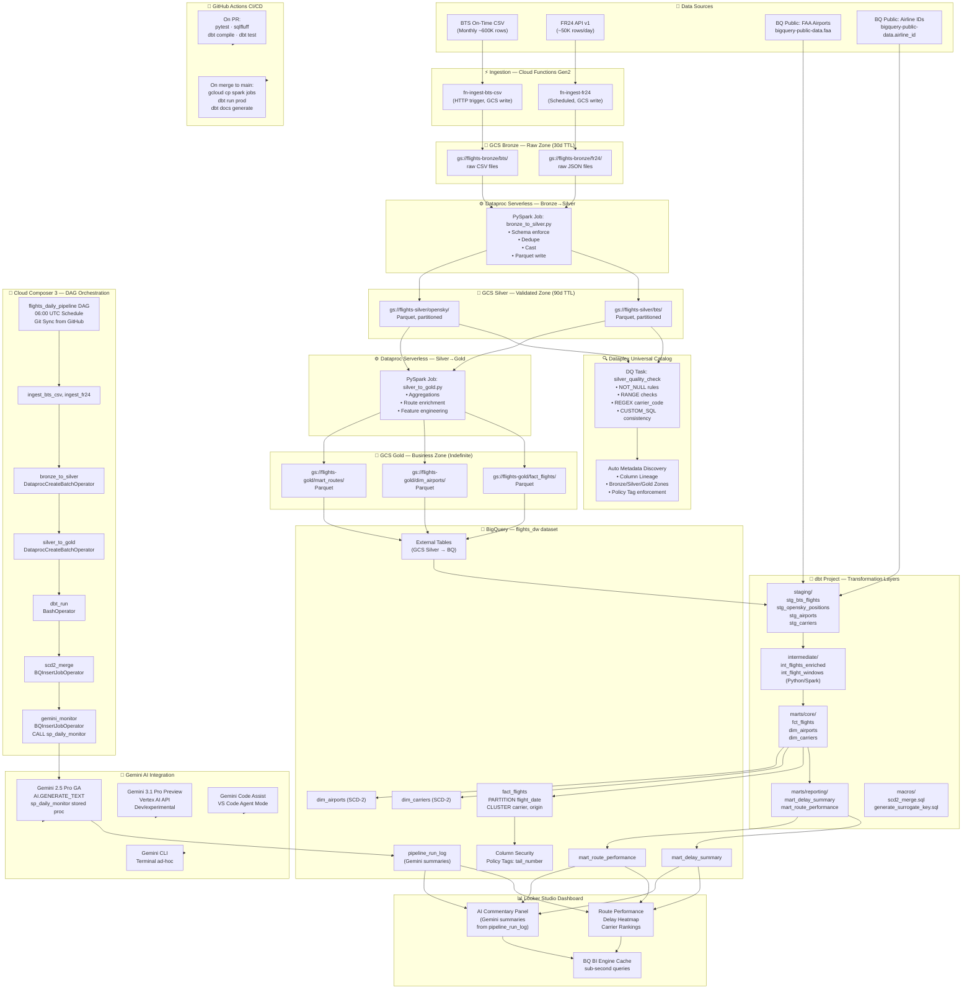

# GCP Flights Data Pipeline — Full Implementation Guide
> **Project:** `flights-analytics-prod` | **Region:** `europe-west2` | **Stack:** GCS Lakehouse · BigQuery · Dataproc Serverless · dbt · Cloud Composer 3 · Dataplex · Gemini AI

---

## 1. Architecture Diagram



---

## 2. Step-by-Step Implementation Plan

### Phase 1: GCP Foundation

**Objective:** Provision all base infrastructure — project, APIs, service accounts, GCS buckets, BigQuery datasets, Dataplex lake.

#### 1.1 Project & API Enablement
```bash
# Set project
gcloud config set project flights-analytics-prod
gcloud config set compute/region europe-west2

# Enable all required APIs
gcloud services enable \
  bigquery.googleapis.com \
  bigquerydatapolicy.googleapis.com \
  bigqueryconnection.googleapis.com \
  storage.googleapis.com \
  dataproc.googleapis.com \
  dataplex.googleapis.com \
  composer.googleapis.com \
  cloudfunctions.googleapis.com \
  cloudbuild.googleapis.com \
  aiplatform.googleapis.com \
  secretmanager.googleapis.com \
  cloudscheduler.googleapis.com \
  artifactregistry.googleapis.com \
  iam.googleapis.com
```

#### 1.2 Service Accounts
```bash
# Pipeline runner SA
gcloud iam service-accounts create flights-pipeline-sa \
  --display-name="Flights Pipeline Service Account" \
  --project=flights-analytics-prod

# Dataproc SA
gcloud iam service-accounts create flights-dataproc-sa \
  --display-name="Flights Dataproc Service Account" \
  --project=flights-analytics-prod

# GitHub Actions SA
gcloud iam service-accounts create flights-cicd-sa \
  --display-name="Flights CI/CD Service Account" \
  --project=flights-analytics-prod

SA_EMAIL="flights-pipeline-sa@flights-analytics-prod.iam.gserviceaccount.com"
DP_SA_EMAIL="flights-dataproc-sa@flights-analytics-prod.iam.gserviceaccount.com"
CICD_SA_EMAIL="flights-cicd-sa@flights-analytics-prod.iam.gserviceaccount.com"
PROJECT="flights-analytics-prod"

# Pipeline SA roles
for ROLE in \
  roles/bigquery.dataEditor \
  roles/bigquery.jobUser \
  roles/storage.objectAdmin \
  roles/dataproc.editor \
  roles/dataplex.editor \
  roles/aiplatform.user \
  roles/composer.worker \
  roles/bigquery.connectionUser; do
  gcloud projects add-iam-policy-binding $PROJECT \
    --member="serviceAccount:${SA_EMAIL}" \
    --role="$ROLE"
done

# Dataproc SA roles
for ROLE in \
  roles/bigquery.dataEditor \
  roles/bigquery.jobUser \
  roles/storage.objectAdmin \
  roles/dataproc.worker; do
  gcloud projects add-iam-policy-binding $PROJECT \
    --member="serviceAccount:${DP_SA_EMAIL}" \
    --role="$ROLE"
done

# CI/CD SA roles
for ROLE in \
  roles/bigquery.dataEditor \
  roles/bigquery.jobUser \
  roles/storage.objectAdmin \
  roles/dataproc.editor \
  roles/iam.serviceAccountTokenCreator; do
  gcloud projects add-iam-policy-binding $PROJECT \
    --member="serviceAccount:${CICD_SA_EMAIL}" \
    --role="$ROLE"
done

# Generate CI/CD SA key for GitHub Actions
gcloud iam service-accounts keys create cicd-sa-key.json \
  --iam-account=$CICD_SA_EMAIL
```

#### 1.3 GCS Buckets with Lifecycle Rules
```bash
# Create buckets
for BUCKET in \
  flights-bronze-flights-analytics-prod \
  flights-silver-flights-analytics-prod \
  flights-gold-flights-analytics-prod \
  flights-spark-artifacts \
  flights-dbt-artifacts \
  flights-composer-bucket; do
  gcloud storage buckets create gs://$BUCKET \
    --location=europe-west2 \
    --uniform-bucket-level-access \
    --project=flights-analytics-prod
done

# Bronze lifecycle — 30 day TTL
cat > /tmp/bronze_lifecycle.json << 'EOF'
{
  "lifecycle": {
    "rule": [
      {
        "action": {"type": "Delete"},
        "condition": {"age": 30}
      }
    ]
  }
}
EOF
gcloud storage buckets update \
  gs://flights-bronze-flights-analytics-prod \
  --lifecycle-file=/tmp/bronze_lifecycle.json

# Silver lifecycle — 90 day TTL
cat > /tmp/silver_lifecycle.json << 'EOF'
{
  "lifecycle": {
    "rule": [
      {
        "action": {"type": "Delete"},
        "condition": {"age": 90}
      }
    ]
  }
}
EOF
gcloud storage buckets update \
  gs://flights-silver-flights-analytics-prod \
  --lifecycle-file=/tmp/silver_lifecycle.json
```

#### 1.4 BigQuery Datasets
```bash
bq mk --dataset \
  --location=europe-west2 \
  --description="Raw staging external tables" \
  flights-analytics-prod:flights_raw

bq mk --dataset \
  --location=europe-west2 \
  --description="Core DW — SCD-2 dims, fact tables" \
  flights-analytics-prod:flights_dw

bq mk --dataset \
  --location=europe-west2 \
  --description="Reporting marts for Looker Studio" \
  flights-analytics-prod:flights_marts

bq mk --dataset \
  --location=europe-west2 \
  --description="dbt staging models" \
  flights-analytics-prod:flights_staging
```

#### 1.5 Dataplex Lake, Zones & Assets
```bash
# Create Dataplex lake
gcloud dataplex lakes create flights-lake \
  --location=europe-west2 \
  --display-name="Flights Analytics Lake" \
  --project=flights-analytics-prod

# Create zones
gcloud dataplex zones create bronze-zone \
  --lake=flights-lake \
  --location=europe-west2 \
  --type=RAW \
  --resource-location-type=SINGLE_REGION \
  --display-name="Bronze Raw Zone" \
  --project=flights-analytics-prod

gcloud dataplex zones create silver-zone \
  --lake=flights-lake \
  --location=europe-west2 \
  --type=CURATED \
  --resource-location-type=SINGLE_REGION \
  --display-name="Silver Curated Zone" \
  --project=flights-analytics-prod

gcloud dataplex zones create gold-zone \
  --lake=flights-lake \
  --location=europe-west2 \
  --type=CURATED \
  --resource-location-type=SINGLE_REGION \
  --display-name="Gold Business Zone" \
  --project=flights-analytics-prod

# Add GCS assets to zones
gcloud dataplex assets create bronze-bts-asset \
  --lake=flights-lake \
  --zone=bronze-zone \
  --location=europe-west2 \
  --resource-type=STORAGE_BUCKET \
  --resource-name=projects/flights-analytics-prod/buckets/flights-bronze-flights-analytics-prod \
  --display-name="Bronze BTS Data" \
  --project=flights-analytics-prod

gcloud dataplex assets create silver-flights-asset \
  --lake=flights-lake \
  --zone=silver-zone \
  --location=europe-west2 \
  --resource-type=STORAGE_BUCKET \
  --resource-name=projects/flights-analytics-prod/buckets/flights-silver-flights-analytics-prod \
  --display-name="Silver Flights Data" \
  --project=flights-analytics-prod

gcloud dataplex assets create gold-flights-asset \
  --lake=flights-lake \
  --zone=gold-zone \
  --location=europe-west2 \
  --resource-type=STORAGE_BUCKET \
  --resource-name=projects/flights-analytics-prod/buckets/flights-gold-flights-analytics-prod \
  --display-name="Gold Flights Data" \
  --project=flights-analytics-prod

# Add BigQuery dataset assets
gcloud dataplex assets create gold-bq-asset \
  --lake=flights-lake \
  --zone=gold-zone \
  --location=europe-west2 \
  --resource-type=BIGQUERY_DATASET \
  --resource-name=projects/flights-analytics-prod/datasets/flights_dw \
  --display-name="Gold BQ Dataset" \
  --project=flights-analytics-prod
```

---

### Phase 2: Ingestion — Cloud Functions Gen2

**File:** `cloud_functions/ingest_bts_csv/main.py`
```python
"""
Cloud Function Gen2 — BTS On-Time Performance CSV Ingestion.
Triggered via HTTP (Composer CloudFunctionInvokeFunctionOperator).
Downloads the most recent BTS monthly CSV and writes to GCS Bronze.
Python 3.12
"""
import functions_framework
import requests
import io
import logging
from datetime import datetime, timezone
from google.cloud import storage

logging.basicConfig(level=logging.INFO)
logger = logging.getLogger(__name__)

PROJECT_ID = "flights-analytics-prod"
BRONZE_BUCKET = "flights-bronze-flights-analytics-prod"
BTS_BASE_URL = (
    "https://transtats.bts.gov/PREZIP/"
    "On_Time_Reporting_Carrier_On_Time_Performance_1987_present"
)


def build_bts_url(year: int, month: int) -> str:
    return f"{BTS_BASE_URL}_{year}_{month}.zip"


@functions_framework.http
def ingest_bts_csv(request):
    """HTTP-triggered function to download BTS CSV and upload to GCS Bronze."""
    try:
        request_json = request.get_json(silent=True) or {}
        now_utc = datetime.now(timezone.utc)
        year = request_json.get("year", now_utc.year)
        month = request_json.get("month", now_utc.month - 1 or 12)
        if month == 0:
            month = 12
            year -= 1

        url = build_bts_url(year, month)
        logger.info(f"Downloading BTS data from: {url}")

        response = requests.get(url, timeout=300, stream=True)
        response.raise_for_status()

        gcs_client = storage.Client(project=PROJECT_ID)
        bucket = gcs_client.bucket(BRONZE_BUCKET)

        run_date = now_utc.strftime("%Y%m%d")
        blob_name = f"bts/{year}/{month:02d}/raw_{run_date}.zip"
        blob = bucket.blob(blob_name)

        with io.BytesIO(response.content) as buffer:
            blob.upload_from_file(buffer, content_type="application/zip")

        logger.info(f"Uploaded {len(response.content):,} bytes to gs://{BRONZE_BUCKET}/{blob_name}")
        return {
            "status": "success",
            "gcs_path": f"gs://{BRONZE_BUCKET}/{blob_name}",
            "year": year,
            "month": month,
            "bytes_written": len(response.content),
        }, 200

    except requests.HTTPError as e:
        logger.error(f"HTTP error downloading BTS data: {e}")
        return {"status": "error", "message": str(e)}, 500
    except Exception as e:
        logger.error(f"Unexpected error: {e}", exc_info=True)
        return {"status": "error", "message": str(e)}, 500
```

**File:** `cloud_functions/ingest_bts_csv/requirements.txt`
```
functions-framework==3.8.1
google-cloud-storage==2.18.2
requests==2.32.3
```

**File:** `cloud_functions/ingest_fr24/main.py`
```python
"""
Cloud Function Gen2 — FlightRadar24 API v1 Ingestion.
Fetches live flight positions for a bounding box covering UK/EU airspace.
Python 3.12
"""
import functions_framework
import requests
import json
import logging
from datetime import datetime, timezone
from google.cloud import storage
from google.cloud import secretmanager

logging.basicConfig(level=logging.INFO)
logger = logging.getLogger(__name__)

PROJECT_ID = "flights-analytics-prod"
BRONZE_BUCKET = "flights-bronze-flights-analytics-prod"

# Bounding box: UK + NW Europe (north, south, west, east)
FR24_URL = "https://fr24api.flightradar24.com/api/live/flight-positions/full"
FR24_BOUNDS = "61.5,49.0,-8.5,10.5"
FR24_SECRET_ID = "fr24-api-key"


def _get_secret(project_id: str, secret_id: str, version_id: str = "latest") -> str:
    """Retrieves a secret from Google Cloud Secret Manager."""
    client = secretmanager.SecretManagerServiceClient()
    name = f"projects/{project_id}/secrets/{secret_id}/versions/{version_id}"
    response = client.access_secret_version(request={"name": name})
    return response.payload.data.decode("UTF-8")


@functions_framework.http
def ingest_fr24(request):
    """HTTP-triggered function to fetch FR24 positions and write NDJSON to Bronze GCS."""
    try:
        now_utc = datetime.now(timezone.utc)
        api_key = _get_secret(PROJECT_ID, FR24_SECRET_ID)

        headers = {"Accept-Version": "v1", "Authorization": f"Bearer {api_key}"}
        params = {"bounds": FR24_BOUNDS}

        response = requests.get(FR24_URL, headers=headers, params=params, timeout=60)
        response.raise_for_status()
        flights = response.json().get("data", [])

        if not flights:
            return {"status": "success", "rows_written": 0}, 200

        ingestion_ts = now_utc.isoformat()
        ndjson_lines = []
        for flight in flights:
            record = flight.copy()
            record["ingestion_timestamp"] = ingestion_ts
            ndjson_lines.append(json.dumps(record))

        ndjson_content = "\n".join(ndjson_lines)
        blob_name = (
            f"fr24/{now_utc.year}/{now_utc.month:02d}/"
            f"{now_utc.day:02d}/positions_{now_utc.strftime('%Y%m%d_%H%M%S')}.ndjson"
        )

        gcs_client = storage.Client(project=PROJECT_ID)
        bucket = gcs_client.bucket(BRONZE_BUCKET)
        blob = bucket.blob(blob_name)
        blob.upload_from_string(ndjson_content, content_type="application/x-ndjson")

        return {
            "status": "success",
            "gcs_path": f"gs://{BRONZE_BUCKET}/{blob_name}",
            "rows_written": len(flights),
            "fetch_timestamp": ingestion_ts,
        }, 200

    except Exception as e:
        logger.error(f"Unexpected error: {e}", exc_info=True)
        return {"status": "error", "message": str(e)}, 500
```

**Deploy Cloud Functions:**
```bash
# Deploy BTS ingest function
gcloud functions deploy fn-ingest-bts-csv \
  --gen2 \
  --runtime=python312 \
  --region=europe-west2 \
  --source=cloud_functions/ingest_bts_csv \
  --entry-point=ingest_bts_csv \
  --trigger-http \
  --no-allow-unauthenticated \
  --service-account=flights-pipeline-sa@flights-analytics-prod.iam.gserviceaccount.com \
  --timeout=540s \
  --memory=512Mi \
  --project=flights-analytics-prod

# Deploy FR24 ingest function
gcloud functions deploy fn-ingest-fr24 \
  --gen2 \
  --runtime=python312 \
  --region=europe-west2 \
  --source=cloud_functions/ingest_fr24 \
  --entry-point=ingest_fr24 \
  --trigger-http \
  --no-allow-unauthenticated \
  --service-account=flights-pipeline-sa@flights-analytics-prod.iam.gserviceaccount.com \
  --timeout=120s \
  --memory=256Mi \
  --project=flights-analytics-prod
```

---

### Phase 3: PySpark Bronze→Silver + Dataplex DQ

**File:** `spark_jobs/bronze_to_silver.py`
```python
"""
Dataproc Serverless PySpark Job: Bronze → Silver transformation.
- Reads raw BTS CSV ZIP and OpenSky NDJSON from GCS Bronze
- Enforces schema, deduplicates, casts types
- Writes Parquet to GCS Silver partitioned by flight_date
Python 3.12 / PySpark 3.5
"""
import sys
import logging
from datetime import datetime, timezone
from pyspark.sql import SparkSession
from pyspark.sql import functions as F
from pyspark.sql.types import (
    StructType, StructField, StringType, IntegerType,
    DoubleType, BooleanType, TimestampType, DateType,
)

logging.basicConfig(level=logging.INFO, stream=sys.stdout)
logger = logging.getLogger(__name__)

PROJECT_ID = "flights-analytics-prod"
BRONZE_BUCKET = f"gs://flights-bronze-{PROJECT_ID}"
SILVER_BUCKET = f"gs://flights-silver-{PROJECT_ID}"

BTS_SCHEMA = StructType([
    StructField("Year", IntegerType(), True),
    StructField("Month", IntegerType(), True),
    StructField("DayofMonth", IntegerType(), True),
    StructField("DayOfWeek", IntegerType(), True),
    StructField("FlightDate", StringType(), True),
    StructField("Reporting_Airline", StringType(), True),
    StructField("Tail_Number", StringType(), True),
    StructField("Flight_Number_Reporting_Airline", StringType(), True),
    StructField("Origin", StringType(), True),
    StructField("OriginCityName", StringType(), True),
    StructField("OriginState", StringType(), True),
    StructField("Dest", StringType(), True),
    StructField("DestCityName", StringType(), True),
    StructField("DestState", StringType(), True),
    StructField("CRSDepTime", StringType(), True),
    StructField("DepTime", StringType(), True),
    StructField("DepDelay", DoubleType(), True),
    StructField("TaxiOut", DoubleType(), True),
    StructField("WheelsOff", StringType(), True),
    StructField("WheelsOn", StringType(), True),
    StructField("TaxiIn", DoubleType(), True),
    StructField("CRSArrTime", StringType(), True),
    StructField("ArrTime", StringType(), True),
    StructField("ArrDelay", DoubleType(), True),
    StructField("Cancelled", DoubleType(), True),
    StructField("CancellationCode", StringType(), True),
    StructField("Diverted", DoubleType(), True),
    StructField("CRSElapsedTime", DoubleType(), True),
    StructField("ActualElapsedTime", DoubleType(), True),
    StructField("AirTime", DoubleType(), True),
    StructField("Distance", DoubleType(), True),
    StructField("CarrierDelay", DoubleType(), True),
    StructField("WeatherDelay", DoubleType(), True),
    StructField("NASDelay", DoubleType(), True),
    StructField("SecurityDelay", DoubleType(), True),
    StructField("LateAircraftDelay", DoubleType(), True),
])


def get_spark_session() -> SparkSession:
    return (
        SparkSession.builder
        .appName("flights-bronze-to-silver")
        .config("spark.sql.adaptive.enabled", "true")
        .config("spark.sql.adaptive.coalescePartitions.enabled", "true")
        .config("spark.sql.parquet.compression.codec", "snappy")
        .config(
            "spark.hadoop.fs.gs.impl",
            "com.google.cloud.hadoop.fs.gcs.GoogleHadoopFileSystem",
        )
        .config("spark.hadoop.google.cloud.auth.service.account.enable", "true")
        .getOrCreate()
    )


def process_bts_bronze(spark: SparkSession, run_date: str) -> int:
    """Read BTS CSV from Bronze, enforce schema, deduplicate, write Silver Parquet."""
    year = run_date[:4]
    month = run_date[4:6]
    bronze_path = f"{BRONZE_BUCKET}/bts/{year}/{month}/*.zip"

    logger.info(f"Reading BTS bronze from: {bronze_path}")
    raw_df = (
        spark.read
        .option("header", "true")
        .option("inferSchema", "false")
        .schema(BTS_SCHEMA)
        .csv(bronze_path)
    )

    silver_df = (
        raw_df
        .filter(F.col("FlightDate").isNotNull())
        .withColumn("flight_date", F.to_date(F.col("FlightDate"), "yyyy-MM-dd"))
        .withColumn("carrier_code", F.trim(F.col("Reporting_Airline")))
        .withColumn("tail_number", F.upper(F.trim(F.col("Tail_Number"))))
        .withColumn("flight_number", F.trim(F.col("Flight_Number_Reporting_Airline")))
        .withColumn("origin_airport", F.upper(F.trim(F.col("Origin"))))
        .withColumn("dest_airport", F.upper(F.trim(F.col("Dest"))))
        .withColumn("dep_delay_minutes", F.col("DepDelay").cast(DoubleType()))
        .withColumn("arr_delay_minutes", F.col("ArrDelay").cast(DoubleType()))
        .withColumn("is_cancelled", (F.col("Cancelled") == 1.0).cast(BooleanType()))
        .withColumn("is_diverted", (F.col("Diverted") == 1.0).cast(BooleanType()))
        .withColumn("distance_miles", F.col("Distance").cast(DoubleType()))
        .withColumn("air_time_minutes", F.col("AirTime").cast(DoubleType()))
        .withColumn("carrier_delay_minutes", F.col("CarrierDelay").cast(DoubleType()))
        .withColumn("weather_delay_minutes", F.col("WeatherDelay").cast(DoubleType()))
        .withColumn("nas_delay_minutes", F.col("NASDelay").cast(DoubleType()))
        .withColumn("cancellation_code", F.col("CancellationCode"))
        .withColumn(
            "ingestion_timestamp",
            F.lit(datetime.now(timezone.utc).isoformat()).cast(TimestampType()),
        )
        .withColumn(
            "row_hash",
            F.md5(
                F.concat_ws(
                    "|",
                    F.col("carrier_code"),
                    F.col("flight_number"),
                    F.col("flight_date"),
                    F.col("origin_airport"),
                    F.col("dest_airport"),
                )
            ),
        )
        .dropDuplicates(["row_hash"])
        .select(
            "flight_date", "carrier_code", "tail_number", "flight_number",
            "origin_airport", "dest_airport", "dep_delay_minutes",
            "arr_delay_minutes", "is_cancelled", "is_diverted",
            "distance_miles", "air_time_minutes", "carrier_delay_minutes",
            "weather_delay_minutes", "nas_delay_minutes", "cancellation_code",
            "row_hash", "ingestion_timestamp",
        )
    )

    silver_path = f"{SILVER_BUCKET}/bts"
    logger.info(f"Writing BTS Silver Parquet to: {silver_path}")
    (
        silver_df
        .repartition(F.col("flight_date"))
        .write
        .mode("overwrite")
        .partitionBy("flight_date")
        .parquet(silver_path)
    )

    row_count = silver_df.count()
    logger.info(f"BTS Silver: wrote {row_count:,} rows")
    return row_count


def process_opensky_bronze(spark: SparkSession, run_date: str) -> int:
    """Read OpenSky NDJSON from Bronze, schema enforce, write Silver Parquet."""
    year = run_date[:4]
    month = run_date[4:6]
    day = run_date[6:8]
    bronze_path = f"{BRONZE_BUCKET}/opensky/{year}/{month}/{day}/*.ndjson"

    logger.info(f"Reading OpenSky bronze from: {bronze_path}")
    raw_df = spark.read.json(bronze_path)

    silver_df = (
        raw_df
        .withColumn("position_date", F.to_date(F.col("ingestion_timestamp")))
        .withColumn("icao24", F.upper(F.trim(F.col("icao24"))))
        .withColumn("callsign", F.trim(F.col("callsign")))
        .withColumn("latitude", F.col("latitude").cast(DoubleType()))
        .withColumn("longitude", F.col("longitude").cast(DoubleType()))
        .withColumn("baro_altitude_m", F.col("baro_altitude").cast(DoubleType()))
        .withColumn("velocity_ms", F.col("velocity").cast(DoubleType()))
        .withColumn("on_ground", F.col("on_ground").cast(BooleanType()))
        .withColumn("vertical_rate_ms", F.col("vertical_rate").cast(DoubleType()))
        .withColumn(
            "ingestion_timestamp",
            F.col("ingestion_timestamp").cast(TimestampType()),
        )
        .filter(F.col("icao24").isNotNull())
        .dropDuplicates(["icao24", "ingestion_timestamp"])
        .select(
            "position_date", "icao24", "callsign", "origin_country",
            "latitude", "longitude", "baro_altitude_m", "velocity_ms",
            "on_ground", "vertical_rate_ms", "ingestion_timestamp",
        )
    )

    silver_path = f"{SILVER_BUCKET}/opensky"
    (
        silver_df
        .repartition(F.col("position_date"))
        .write
        .mode("overwrite")
        .partitionBy("position_date")
        .parquet(silver_path)
    )

    row_count = silver_df.count()
    logger.info(f"OpenSky Silver: wrote {row_count:,} rows")
    return row_count


def main():
    if len(sys.argv) < 2:
        run_date = datetime.now(timezone.utc).strftime("%Y%m%d")
    else:
        run_date = sys.argv[1]

    logger.info(f"Starting Bronze → Silver pipeline for run_date={run_date}")
    spark = get_spark_session()

    try:
        bts_rows = process_bts_bronze(spark, run_date)
        opensky_rows = process_opensky_bronze(spark, run_date)
        logger.info(
            f"Bronze→Silver complete. BTS={bts_rows:,} rows, OpenSky={opensky_rows:,} rows"
        )
    finally:
        spark.stop()


if __name__ == "__main__":
    main()
```

**File:** `dataplex/dq_rules/silver_flights_dq.yaml`
```yaml
# Dataplex Data Quality Task — Silver BTS Flights
# Apply to: gs://flights-silver-flights-analytics-prod/bts/
---
rules:
  - rule_type: NOT_NULL
    column: flight_date
    dimension: COMPLETENESS
    description: "flight_date must not be null"

  - rule_type: NOT_NULL
    column: carrier_code
    dimension: COMPLETENESS
    description: "carrier_code must not be null"

  - rule_type: NOT_NULL
    column: origin_airport
    dimension: COMPLETENESS
    description: "origin_airport must not be null"

  - rule_type: NOT_NULL
    column: dest_airport
    dimension: COMPLETENESS
    description: "dest_airport must not be null"

  - rule_type: RANGE
    column: dep_delay_minutes
    dimension: VALIDITY
    min_value: -60.0
    max_value: 1440.0
    ignore_null: true
    description: "Departure delay must be between -60 and 1440 minutes"

  - rule_type: RANGE
    column: arr_delay_minutes
    dimension: VALIDITY
    min_value: -120.0
    max_value: 1440.0
    ignore_null: true
    description: "Arrival delay must be between -120 and 1440 minutes"

  - rule_type: RANGE
    column: distance_miles
    dimension: VALIDITY
    min_value: 1.0
    max_value: 12000.0
    ignore_null: true
    description: "Flight distance must be between 1 and 12000 miles"

  - rule_type: REGEX
    column: carrier_code
    dimension: VALIDITY
    regex: "^[A-Z0-9]{2}$"
    description: "Carrier code must be 2-char alphanumeric uppercase"

  - rule_type: REGEX
    column: origin_airport
    dimension: VALIDITY
    regex: "^[A-Z]{3}$"
    description: "Origin airport must be 3-char IATA code"

  - rule_type: REGEX
    column: dest_airport
    dimension: VALIDITY
    regex: "^[A-Z]{3}$"
    description: "Destination airport must be 3-char IATA code"

  - rule_type: CUSTOM_SQL_EXPR
    dimension: CONSISTENCY
    sql_expression: >
      COUNTIF(is_cancelled = TRUE AND cancellation_code IS NULL) = 0
    description: "Cancelled flights must have a cancellation code"

  - rule_type: CUSTOM_SQL_EXPR
    dimension: CONSISTENCY
    sql_expression: >
      COUNTIF(is_cancelled = FALSE AND is_diverted = FALSE
              AND arr_delay_minutes IS NULL
              AND air_time_minutes IS NOT NULL) = 0
    description: "Non-cancelled, non-diverted flights must have arrival delay"

sampling_percent: 100.0
row_filter: "flight_date >= DATE_SUB(CURRENT_DATE(), INTERVAL 2 DAY)"
```

**Create Dataplex DQ Task:**
```bash
gcloud dataplex datascans create data-quality silver-flights-dq \
  --location=europe-west2 \
  --data-source-resource="//storage.googleapis.com/projects/flights-analytics-prod/buckets/flights-silver-flights-analytics-prod" \
  --data-quality-spec-file=dataplex/dq_rules/silver_flights_dq.yaml \
  --display-name="Silver BTS Flights DQ Scan" \
  --project=flights-analytics-prod
```

---

### Phase 4: PySpark Silver→Gold

**File:** `spark_jobs/silver_to_gold.py`
```python
"""
Dataproc Serverless PySpark Job: Silver → Gold transformation.
- Reads validated Silver Parquet
- Enriches with public BQ airport/carrier data
- Computes route-level aggregations
- Writes Gold Parquet for BQ external table consumption
Python 3.12 / PySpark 3.5
"""
import sys
import logging
from datetime import datetime, timezone
from pyspark.sql import SparkSession
from pyspark.sql import functions as F
from pyspark.sql.types import DoubleType, LongType

logging.basicConfig(level=logging.INFO, stream=sys.stdout)
logger = logging.getLogger(__name__)

PROJECT_ID = "flights-analytics-prod"
SILVER_BUCKET = f"gs://flights-silver-{PROJECT_ID}"
GOLD_BUCKET = f"gs://flights-gold-{PROJECT_ID}"


def get_spark_session() -> SparkSession:
    return (
        SparkSession.builder
        .appName("flights-silver-to-gold")
        .config("spark.sql.adaptive.enabled", "true")
        .config("spark.sql.adaptive.coalescePartitions.enabled", "true")
        .config("spark.sql.parquet.compression.codec", "snappy")
        .config("viewsEnabled", "true")
        .config("materializationProject", PROJECT_ID)
        .config("materializationDataset", "flights_raw")
        .config(
            "spark.hadoop.fs.gs.impl",
            "com.google.cloud.hadoop.fs.gcs.GoogleHadoopFileSystem",
        )
        .getOrCreate()
    )


def build_fact_flights(spark: SparkSession, run_date: str) -> None:
    """Enrich Silver BTS with computed columns → Gold fact_flights Parquet."""
    silver_path = f"{SILVER_BUCKET}/bts"
    logger.info(f"Reading Silver BTS from: {silver_path}")

    silver_df = spark.read.parquet(silver_path)

    enriched_df = (
        silver_df
        .withColumn(
            "total_delay_minutes",
            F.when(
                F.col("is_cancelled"),
                F.lit(None).cast(DoubleType()),
            ).otherwise(
                F.coalesce(F.col("arr_delay_minutes"), F.lit(0.0))
            ),
        )
        .withColumn(
            "delay_category",
            F.when(F.col("is_cancelled"), F.lit("CANCELLED"))
            .when(F.col("is_diverted"), F.lit("DIVERTED"))
            .when(F.col("total_delay_minutes") <= 0, F.lit("ON_TIME"))
            .when(F.col("total_delay_minutes") <= 15, F.lit("MINOR_DELAY"))
            .when(F.col("total_delay_minutes") <= 60, F.lit("MODERATE_DELAY"))
            .otherwise(F.lit("SEVERE_DELAY")),
        )
        .withColumn(
            "route_key",
            F.concat_ws("-", F.col("origin_airport"), F.col("dest_airport")),
        )
        .withColumn(
            "flight_surrogate_key",
            F.md5(
                F.concat_ws(
                    "|",
                    F.col("carrier_code"),
                    F.col("flight_number"),
                    F.col("flight_date").cast("string"),
                    F.col("origin_airport"),
                    F.col("dest_airport"),
                )
            ),
        )
    )

    gold_path = f"{GOLD_BUCKET}/fact_flights"
    logger.info(f"Writing fact_flights Gold to: {gold_path}")
    (
        enriched_df
        .repartition(F.col("flight_date"))
        .write
        .mode("overwrite")
        .partitionBy("flight_date")
        .parquet(gold_path)
    )
    logger.info(f"fact_flights Gold written successfully.")


def build_route_aggregates(spark: SparkSession) -> None:
    """Compute route-level daily aggregates → Gold mart_route_performance Parquet."""
    silver_df = spark.read.parquet(f"{SILVER_BUCKET}/bts")

    route_df = (
        silver_df
        .filter(~F.col("is_cancelled"))
        .groupBy("flight_date", "carrier_code", "origin_airport", "dest_airport")
        .agg(
            F.count("*").alias("total_flights"),
            F.avg("dep_delay_minutes").alias("avg_dep_delay_minutes"),
            F.avg("arr_delay_minutes").alias("avg_arr_delay_minutes"),
            F.percentile_approx("arr_delay_minutes", 0.5).alias("median_arr_delay_minutes"),
            F.percentile_approx("arr_delay_minutes", 0.95).alias("p95_arr_delay_minutes"),
            F.avg("distance_miles").alias("avg_distance_miles"),
            F.sum(
                F.when(F.col("arr_delay_minutes") > 60, 1).otherwise(0)
            ).cast(LongType()).alias("severe_delay_count"),
        )
        .withColumn(
            "on_time_rate",
            F.round(
                1.0 - (F.col("severe_delay_count") / F.col("total_flights")),
                4,
            ),
        )
    )

    gold_path = f"{GOLD_BUCKET}/mart_route_performance"
    logger.info(f"Writing mart_route_performance Gold to: {gold_path}")
    (
        route_df
        .repartition(F.col("flight_date"))
        .write
        .mode("overwrite")
        .partitionBy("flight_date")
        .parquet(gold_path)
    )
    logger.info("mart_route_performance Gold written successfully.")


def main():
    if len(sys.argv) < 2:
        run_date = datetime.now(timezone.utc).strftime("%Y%m%d")
    else:
        run_date = sys.argv[1]

    logger.info(f"Starting Silver → Gold pipeline for run_date={run_date}")
    spark = get_spark_session()

    try:
        build_fact_flights(spark, run_date)
        build_route_aggregates(spark)
        logger.info("Silver → Gold complete.")
    finally:
        spark.stop()


if __name__ == "__main__":
    main()
```

---

### Phase 5: BigQuery DDL

**File:** `bigquery/ddl/create_tables.sql`
```sql
-- ============================================================
-- BigQuery DDL — flights_analytics_prod
-- All tables: europe-west2
-- ============================================================

-- ── dim_airports (SCD-2) ─────────────────────────────────────
CREATE TABLE IF NOT EXISTS `flights-analytics-prod.flights_dw.dim_airports`
(
  airport_sk          STRING    NOT NULL  OPTIONS(description="Surrogate key (MD5)"),
  airport_code        STRING    NOT NULL  OPTIONS(description="IATA 3-letter code"),
  airport_name        STRING              OPTIONS(description="Full airport name"),
  city                STRING              OPTIONS(description="City name"),
  state_code          STRING              OPTIONS(description="US state code"),
  country_code        STRING              OPTIONS(description="ISO country code"),
  latitude            FLOAT64             OPTIONS(description="Airport latitude"),
  longitude           FLOAT64             OPTIONS(description="Airport longitude"),
  elevation_ft        INT64               OPTIONS(description="Elevation in feet"),
  row_hash            STRING    NOT NULL  OPTIONS(description="MD5 of key attributes for change detection"),
  is_current          BOOL      NOT NULL  OPTIONS(description="TRUE = active record"),
  effective_from      DATE      NOT NULL  OPTIONS(description="SCD-2 validity start"),
  effective_to        DATE                OPTIONS(description="SCD-2 validity end; NULL = current"),
  dbt_updated_at      TIMESTAMP           OPTIONS(description="dbt load timestamp"),
  dbt_created_at      TIMESTAMP           OPTIONS(description="dbt first-seen timestamp")
)
OPTIONS(
  description="SCD-2 dimension: airports sourced from FAA public data",
  labels=[("env","prod"),("layer","gold"),("domain","flights")]
);

-- ── dim_carriers (SCD-2) ─────────────────────────────────────
CREATE TABLE IF NOT EXISTS `flights-analytics-prod.flights_dw.dim_carriers`
(
  carrier_sk          STRING    NOT NULL  OPTIONS(description="Surrogate key (MD5)"),
  carrier_code        STRING    NOT NULL  OPTIONS(description="IATA 2-char carrier code"),
  carrier_name        STRING              OPTIONS(description="Full carrier name"),
  carrier_group       STRING              OPTIONS(description="Major/Regional/LCC grouping"),
  row_hash            STRING    NOT NULL  OPTIONS(description="MD5 of key attributes"),
  is_current          BOOL      NOT NULL,
  effective_from      DATE      NOT NULL,
  effective_to        DATE,
  dbt_updated_at      TIMESTAMP,
  dbt_created_at      TIMESTAMP
)
OPTIONS(
  description="SCD-2 dimension: airline carriers",
  labels=[("env","prod"),("layer","gold"),("domain","flights")]
);

-- ── fact_flights ──────────────────────────────────────────────
CREATE TABLE IF NOT EXISTS `flights-analytics-prod.flights_dw.fact_flights`
(
  flight_sk               STRING    NOT NULL  OPTIONS(description="Surrogate key"),
  flight_date             DATE      NOT NULL  OPTIONS(description="Partition key"),
  carrier_code            STRING    NOT NULL  OPTIONS(description="Cluster key 1"),
  origin_airport          STRING    NOT NULL  OPTIONS(description="Cluster key 2"),
  dest_airport            STRING    NOT NULL,
  carrier_sk              STRING              OPTIONS(description="FK to dim_carriers"),
  origin_airport_sk       STRING              OPTIONS(description="FK to dim_airports origin"),
  dest_airport_sk         STRING              OPTIONS(description="FK to dim_airports dest"),
  flight_number           STRING,
  tail_number             STRING              OPTIONS(description="Policy-tagged: SENSITIVE_PII"),
  dep_delay_minutes       FLOAT64,
  arr_delay_minutes       FLOAT64,
  total_delay_minutes     FLOAT64,
  delay_category          STRING              OPTIONS(description="ON_TIME/MINOR/MODERATE/SEVERE/CANCELLED/DIVERTED"),
  is_cancelled            BOOL,
  is_diverted             BOOL,
  cancellation_code       STRING,
  distance_miles          FLOAT64,
  air_time_minutes        FLOAT64,
  carrier_delay_minutes   FLOAT64,
  weather_delay_minutes   FLOAT64,
  nas_delay_minutes       FLOAT64,
  route_key               STRING              OPTIONS(description="origin-dest concatenation"),
  row_hash                STRING,
  dbt_updated_at          TIMESTAMP,
  dbt_created_at          TIMESTAMP
)
PARTITION BY flight_date
CLUSTER BY carrier_code, origin_airport
OPTIONS(
  description="Core fact table: individual flight events, partitioned by date",
  require_partition_filter=false,
  labels=[("env","prod"),("layer","gold"),("domain","flights")]
);

-- ── mart_delay_summary ────────────────────────────────────────
CREATE TABLE IF NOT EXISTS `flights-analytics-prod.flights_dw.mart_delay_summary`
(
  summary_date            DATE      NOT NULL,
  carrier_code            STRING    NOT NULL,
  total_flights           INT64,
  cancelled_flights       INT64,
  diverted_flights        INT64,
  avg_dep_delay_minutes   FLOAT64,
  avg_arr_delay_minutes   FLOAT64,
  p95_arr_delay_minutes   FLOAT64,
  severe_delay_flights    INT64,
  cancellation_rate       FLOAT64,
  on_time_rate            FLOAT64,
  dbt_updated_at          TIMESTAMP
)
PARTITION BY summary_date
CLUSTER BY carrier_code
OPTIONS(
  description="Daily carrier-level delay summary for Looker Studio",
  labels=[("env","prod"),("layer","mart"),("domain","flights")]
);

-- ── pipeline_run_log (Gemini summaries) ───────────────────────
CREATE TABLE IF NOT EXISTS `flights-analytics-prod.flights_dw.pipeline_run_log`
(
  run_id              STRING    NOT NULL  OPTIONS(description="UUID for this pipeline run"),
  run_date            DATE      NOT NULL,
  run_timestamp       TIMESTAMP NOT NULL,
  total_flights       INT64,
  cancelled_flights   INT64,
  avg_delay_minutes   FLOAT64,
  severe_delay_count  INT64,
  max_delay_minutes   FLOAT64,
  top_carrier_json    JSON                OPTIONS(description="Top 5 carriers by volume"),
  gemini_summary      STRING              OPTIONS(description="Gemini 2.5 Pro 3-sentence executive summary"),
  gemini_model        STRING              OPTIONS(description="Model version used"),
  pipeline_status     STRING,
  dq_pass_rate        FLOAT64             OPTIONS(description="Dataplex DQ pass rate 0-1"),
  created_at          TIMESTAMP           DEFAULT CURRENT_TIMESTAMP()
)
PARTITION BY run_date
OPTIONS(
  description="Daily pipeline run log with Gemini AI commentary",
  labels=[("env","prod"),("layer","monitoring"),("domain","flights")]
);

-- ── External Table: Silver BTS on GCS ─────────────────────────
CREATE EXTERNAL TABLE IF NOT EXISTS `flights-analytics-prod.flights_raw.ext_silver_bts`
WITH PARTITION COLUMNS (
  flight_date DATE
)
OPTIONS (
  format = 'PARQUET',
  uris = ['gs://flights-silver-flights-analytics-prod/bts/*.parquet'],
  hive_partition_uri_prefix = 'gs://flights-silver-flights-analytics-prod/bts',
  require_hive_partition_filter = false
);
```

**Column-Level Security (Policy Tags):**
```bash
# Create policy taxonomy
gcloud data-catalog taxonomies create \
  --location=europe-west2 \
  --display-name="Flights Sensitivity Taxonomy" \
  --description="Data sensitivity classifications for flights pipeline" \
  --project=flights-analytics-prod

# Get taxonomy ID (substitute actual ID from above command output)
TAXONOMY_ID="<taxonomy-id-from-above>"

# Create policy tag
gcloud data-catalog taxonomies policy-tags create \
  --taxonomy=$TAXONOMY_ID \
  --location=europe-west2 \
  --display-name="SENSITIVE_PII" \
  --description="Personal/sensitive: tail numbers, registration data" \
  --project=flights-analytics-prod

# Apply policy tag to tail_number column via BQ
bq query --use_legacy_sql=false "
ALTER TABLE \`flights-analytics-prod.flights_dw.fact_flights\`
ALTER COLUMN tail_number
SET OPTIONS (
  policy_tags=['projects/flights-analytics-prod/locations/europe-west2/taxonomies/${TAXONOMY_ID}/policyTags/<policy-tag-id>']
);"
```

---

### Phase 6: SCD-2 MERGE Logic

**File:** `bigquery/stored_procs/sp_scd2_merge_airports.sql`
```sql
-- SCD-2 MERGE stored procedure for dim_airports
-- Uses MD5 row hash for change detection
CREATE OR REPLACE PROCEDURE `flights-analytics-prod.flights_dw.sp_scd2_merge_airports`()
BEGIN
  DECLARE run_date DATE DEFAULT CURRENT_DATE();

  -- Step 1: Stage new/changed records with row hash
  CREATE OR REPLACE TEMP TABLE staging_airports AS
  SELECT
    MD5(CONCAT(
      COALESCE(airport_id, ''),
      '|',
      COALESCE(airport_name, ''),
      '|',
      COALESCE(city, ''),
      '|',
      COALESCE(state_fips, ''),
      '|',
      COALESCE(country, ''),
      '|',
      COALESCE(CAST(latitude AS STRING), ''),
      '|',
      COALESCE(CAST(longitude AS STRING), '')
    )) AS row_hash,
    MD5(airport_id) AS airport_sk,
    airport_id AS airport_code,
    airport_name,
    city,
    state_fips AS state_code,
    country AS country_code,
    latitude,
    longitude,
    elevation AS elevation_ft
  FROM `bigquery-public-data.faa.us_airports`
  WHERE airport_id IS NOT NULL;

  -- Step 2: Expire records where row_hash has changed
  UPDATE `flights-analytics-prod.flights_dw.dim_airports` AS dim
  SET
    is_current    = FALSE,
    effective_to  = DATE_SUB(run_date, INTERVAL 1 DAY),
    dbt_updated_at = CURRENT_TIMESTAMP()
  WHERE dim.is_current = TRUE
    AND dim.airport_code IN (
      SELECT s.airport_code
      FROM staging_airports s
      JOIN `flights-analytics-prod.flights_dw.dim_airports` d
        ON s.airport_code = d.airport_code
       AND d.is_current = TRUE
       AND s.row_hash != d.row_hash
    );

  -- Step 3: Insert new and changed records
  INSERT INTO `flights-analytics-prod.flights_dw.dim_airports`
  (
    airport_sk, airport_code, airport_name, city, state_code, country_code,
    latitude, longitude, elevation_ft, row_hash, is_current, effective_from,
    effective_to, dbt_updated_at, dbt_created_at
  )
  SELECT
    s.airport_sk,
    s.airport_code,
    s.airport_name,
    s.city,
    s.state_code,
    s.country_code,
    s.latitude,
    s.longitude,
    s.elevation_ft,
    s.row_hash,
    TRUE                AS is_current,
    run_date            AS effective_from,
    NULL                AS effective_to,
    CURRENT_TIMESTAMP() AS dbt_updated_at,
    CURRENT_TIMESTAMP() AS dbt_created_at
  FROM staging_airports s
  WHERE NOT EXISTS (
    SELECT 1
    FROM `flights-analytics-prod.flights_dw.dim_airports` d
    WHERE d.airport_code = s.airport_code
      AND d.is_current = TRUE
  );

  -- Step 4: Log row counts
  SELECT
    COUNTIF(is_current = TRUE)  AS current_records,
    COUNTIF(is_current = FALSE) AS expired_records
  FROM `flights-analytics-prod.flights_dw.dim_airports`;
END;
```

---

### Phase 7: dbt Project

**File:** `dbt/dbt_project.yml`
```yaml
name: 'flights_analytics'
version: '1.0.0'
config-version: 2

profile: 'flights_analytics'

model-paths: ["models"]
analysis-paths: ["analyses"]
test-paths: ["tests"]
seed-paths: ["seeds"]
macro-paths: ["macros"]
snapshot-paths: ["snapshots"]

target-path: "target"
clean-targets: ["target", "dbt_packages"]

vars:
  project_id: "flights-analytics-prod"
  bq_location: "europe-west2"
  start_date: "2023-01-01"

models:
  flights_analytics:
    staging:
      +materialized: view
      +schema: flights_staging
      +tags: ["staging"]
    intermediate:
      +materialized: table
      +schema: flights_dw
      +tags: ["intermediate"]
    marts:
      core:
        +materialized: table
        +schema: flights_dw
        +tags: ["marts", "core"]
        +partition_by:
          field: flight_date
          data_type: date
          granularity: day
        +cluster_by: ["carrier_code", "origin_airport"]
      reporting:
        +materialized: table
        +schema: flights_dw
        +tags: ["marts", "reporting"]
```

**File:** `dbt/profiles.yml`
```yaml
flights_analytics:
  target: dev
  outputs:
    dev:
      type: bigquery
      method: oauth
      project: flights-analytics-prod
      dataset: flights_dw_dev
      location: europe-west2
      threads: 4
      timeout_seconds: 300
      priority: interactive
    prod:
      type: bigquery
      method: service-account
      project: flights-analytics-prod
      dataset: flights_dw
      location: europe-west2
      threads: 8
      timeout_seconds: 600
      priority: batch
      keyfile: /tmp/sa-key.json
      # dbt Python models via Dataproc Serverless
      dataproc_region: europe-west2
      dataproc_project_id: flights-analytics-prod
      submission_method: serverless_spark
      gcs_bucket: flights-spark-artifacts
```

**File:** `dbt/models/staging/stg_bts_flights.sql`
```sql
-- Staging: 1:1 from external Silver BTS table
-- Light casting only — no business logic
{{ config(
    materialized='view',
    tags=['staging', 'bts']
) }}

WITH source AS (
    SELECT *
    FROM {{ source('flights_raw', 'ext_silver_bts') }}
    WHERE flight_date >= DATE('{{ var("start_date") }}')
),

renamed AS (
    SELECT
        CAST(flight_date         AS DATE)    AS flight_date,
        TRIM(carrier_code)                   AS carrier_code,
        UPPER(TRIM(origin_airport))          AS origin_airport,
        UPPER(TRIM(dest_airport))            AS dest_airport,
        TRIM(flight_number)                  AS flight_number,
        UPPER(TRIM(tail_number))             AS tail_number,
        CAST(dep_delay_minutes  AS FLOAT64)  AS dep_delay_minutes,
        CAST(arr_delay_minutes  AS FLOAT64)  AS arr_delay_minutes,
        CAST(distance_miles     AS FLOAT64)  AS distance_miles,
        CAST(air_time_minutes   AS FLOAT64)  AS air_time_minutes,
        CAST(is_cancelled       AS BOOL)     AS is_cancelled,
        CAST(is_diverted        AS BOOL)     AS is_diverted,
        cancellation_code,
        CAST(carrier_delay_minutes AS FLOAT64) AS carrier_delay_minutes,
        CAST(weather_delay_minutes AS FLOAT64) AS weather_delay_minutes,
        CAST(nas_delay_minutes     AS FLOAT64) AS nas_delay_minutes,
        row_hash,
        ingestion_timestamp
    FROM source
)

SELECT * FROM renamed
```

**File:** `dbt/models/staging/stg_airports.sql`
```sql
-- Staging: FAA airports from BigQuery public data
{{ config(
    materialized='view',
    tags=['staging', 'airports']
) }}

SELECT
    TRIM(airport_id)                     AS airport_code,
    TRIM(airport_name)                   AS airport_name,
    TRIM(city)                           AS city,
    TRIM(state_fips)                     AS state_code,
    TRIM(country)                        AS country_code,
    CAST(latitude  AS FLOAT64)           AS latitude,
    CAST(longitude AS FLOAT64)           AS longitude,
    CAST(elevation AS INT64)             AS elevation_ft
FROM `bigquery-public-data.faa.us_airports`
WHERE airport_id IS NOT NULL
  AND TRIM(airport_id) != ''
```

**File:** `dbt/models/staging/stg_carriers.sql`
```sql
-- Staging: Airline carriers from BigQuery public data
{{ config(
    materialized='view',
    tags=['staging', 'carriers']
) }}

SELECT
    TRIM(Code)                AS carrier_code,
    TRIM(Description)         AS carrier_name
FROM `bigquery-public-data.airline_id.airline_id`
WHERE Code IS NOT NULL
  AND TRIM(Code) != ''
```

**File:** `dbt/models/intermediate/int_flights_enriched.sql`
```sql
-- Intermediate: Enrich BTS flights with dim lookups and delay categorisation
{{ config(
    materialized='table',
    tags=['intermediate'],
    partition_by={'field': 'flight_date', 'data_type': 'date'},
    cluster_by=['carrier_code', 'origin_airport']
) }}

WITH flights AS (
    SELECT * FROM {{ ref('stg_bts_flights') }}
),

carriers AS (
    SELECT carrier_code, carrier_name
    FROM {{ ref('stg_carriers') }}
),

origin_airports AS (
    SELECT
        airport_code AS origin_airport,
        airport_name AS origin_airport_name,
        city         AS origin_city,
        state_code   AS origin_state,
        latitude     AS origin_latitude,
        longitude    AS origin_longitude
    FROM {{ ref('stg_airports') }}
),

dest_airports AS (
    SELECT
        airport_code AS dest_airport,
        airport_name AS dest_airport_name,
        city         AS dest_city,
        state_code   AS dest_state
    FROM {{ ref('stg_airports') }}
),

enriched AS (
    SELECT
        f.flight_date,
        f.carrier_code,
        COALESCE(c.carrier_name, f.carrier_code)  AS carrier_name,
        f.origin_airport,
        COALESCE(oa.origin_airport_name, f.origin_airport) AS origin_airport_name,
        oa.origin_city,
        oa.origin_state,
        oa.origin_latitude,
        oa.origin_longitude,
        f.dest_airport,
        COALESCE(da.dest_airport_name, f.dest_airport) AS dest_airport_name,
        da.dest_city,
        da.dest_state,
        f.flight_number,
        f.tail_number,
        f.dep_delay_minutes,
        f.arr_delay_minutes,
        f.distance_miles,
        f.air_time_minutes,
        f.is_cancelled,
        f.is_diverted,
        f.cancellation_code,
        f.carrier_delay_minutes,
        f.weather_delay_minutes,
        f.nas_delay_minutes,
        CASE
            WHEN f.is_cancelled                          THEN 'CANCELLED'
            WHEN f.is_diverted                           THEN 'DIVERTED'
            WHEN COALESCE(f.arr_delay_minutes, 0) <= 0   THEN 'ON_TIME'
            WHEN f.arr_delay_minutes <= 15               THEN 'MINOR_DELAY'
            WHEN f.arr_delay_minutes <= 60               THEN 'MODERATE_DELAY'
            ELSE                                              'SEVERE_DELAY'
        END                                            AS delay_category,
        CONCAT(f.origin_airport, '-', f.dest_airport)  AS route_key,
        f.row_hash,
        f.ingestion_timestamp
    FROM flights f
    LEFT JOIN carriers      c  ON f.carrier_code    = c.carrier_code
    LEFT JOIN origin_airports oa ON f.origin_airport = oa.origin_airport
    LEFT JOIN dest_airports   da ON f.dest_airport   = da.dest_airport
)

SELECT * FROM enriched
```

**File:** `dbt/models/intermediate/int_flight_windows.py`
```python
"""
dbt Python model: Rolling window feature engineering.
Runs on Dataproc Serverless (submission_method: serverless_spark).
Computes 7-day and 30-day rolling averages for carrier/route delay metrics.
"""
import pyspark.sql.functions as F
from pyspark.sql.window import Window


def model(dbt, session):
    """
    dbt Python model entry point.
    Args:
        dbt:     dbt context (provides ref(), source(), config())
        session: SparkSession
    Returns:
        Spark DataFrame to be materialized as BigQuery table
    """
    dbt.config(
        materialized="table",
        tags=["intermediate", "python"],
        submission_method="serverless_spark",
    )

    flights_df = dbt.ref("int_flights_enriched")

    # Window specs
    carrier_7d = (
        Window.partitionBy("carrier_code")
        .orderBy(F.col("flight_date").cast("long"))
        .rangeBetween(-6 * 86400, 0)
    )
    carrier_30d = (
        Window.partitionBy("carrier_code")
        .orderBy(F.col("flight_date").cast("long"))
        .rangeBetween(-29 * 86400, 0)
    )
    route_7d = (
        Window.partitionBy("carrier_code", "origin_airport", "dest_airport")
        .orderBy(F.col("flight_date").cast("long"))
        .rangeBetween(-6 * 86400, 0)
    )

    enriched_df = (
        flights_df
        .filter(~F.col("is_cancelled"))
        .withColumn(
            "carrier_avg_arr_delay_7d",
            F.round(F.avg("arr_delay_minutes").over(carrier_7d), 2),
        )
        .withColumn(
            "carrier_avg_arr_delay_30d",
            F.round(F.avg("arr_delay_minutes").over(carrier_30d), 2),
        )
        .withColumn(
            "route_avg_arr_delay_7d",
            F.round(F.avg("arr_delay_minutes").over(route_7d), 2),
        )
        .withColumn(
            "carrier_cancel_rate_7d",
            F.round(
                F.avg(F.col("is_cancelled").cast("int")).over(carrier_7d), 4
            ),
        )
        .withColumn(
            "delay_vs_carrier_avg",
            F.round(
                F.col("arr_delay_minutes") - F.col("carrier_avg_arr_delay_7d"), 2
            ),
        )
    )

    return enriched_df
```

**File:** `dbt/models/marts/core/fct_flights.sql`
```sql
-- Mart: Core fact table — individual flight events
-- Partitioned by flight_date, clustered by carrier_code + origin_airport
{{ config(
    materialized='table',
    tags=['marts', 'core', 'fct'],
    partition_by={'field': 'flight_date', 'data_type': 'date', 'granularity': 'day'},
    cluster_by=['carrier_code', 'origin_airport'],
    labels={'layer': 'gold', 'domain': 'flights'}
) }}

WITH enriched AS (
    SELECT * FROM {{ ref('int_flights_enriched') }}
),

carrier_dim AS (
    SELECT carrier_sk, carrier_code
    FROM {{ ref('dim_carriers') }}
    WHERE is_current = TRUE
),

airport_dim AS (
    SELECT airport_sk, airport_code
    FROM {{ ref('dim_airports') }}
    WHERE is_current = TRUE
),

final AS (
    SELECT
        {{ generate_surrogate_key(['e.carrier_code', 'e.flight_number', 'e.flight_date', 'e.origin_airport', 'e.dest_airport']) }} AS flight_sk,
        e.flight_date,
        e.carrier_code,
        e.origin_airport,
        e.dest_airport,
        c.carrier_sk,
        oa.airport_sk   AS origin_airport_sk,
        da.airport_sk   AS dest_airport_sk,
        e.flight_number,
        e.tail_number,
        e.dep_delay_minutes,
        e.arr_delay_minutes,
        CASE WHEN e.is_cancelled THEN NULL ELSE COALESCE(e.arr_delay_minutes, 0) END AS total_delay_minutes,
        e.delay_category,
        e.is_cancelled,
        e.is_diverted,
        e.cancellation_code,
        e.distance_miles,
        e.air_time_minutes,
        e.carrier_delay_minutes,
        e.weather_delay_minutes,
        e.nas_delay_minutes,
        e.route_key,
        e.row_hash,
        CURRENT_TIMESTAMP() AS dbt_updated_at,
        MIN(e.ingestion_timestamp) OVER (
            PARTITION BY e.carrier_code, e.flight_number, e.flight_date, e.origin_airport
        ) AS dbt_created_at
    FROM enriched e
    LEFT JOIN carrier_dim c  ON e.carrier_code    = c.carrier_code
    LEFT JOIN airport_dim oa ON e.origin_airport   = oa.airport_code
    LEFT JOIN airport_dim da ON e.dest_airport     = da.airport_code
)

SELECT * FROM final
```

**File:** `dbt/models/marts/core/dim_airports.sql`
```sql
-- Mart: dim_airports using SCD-2 macro
{{ config(
    materialized='table',
    tags=['marts', 'core', 'dim'],
    labels={'layer': 'gold', 'domain': 'flights'}
) }}

{{ scd2_merge(
    source_ref=ref('stg_airports'),
    natural_key='airport_code',
    hash_columns=['airport_name', 'city', 'state_code', 'country_code', 'latitude', 'longitude'],
    surrogate_key='airport_sk'
) }}
```

**File:** `dbt/models/marts/core/dim_carriers.sql`
```sql
-- Mart: dim_carriers using SCD-2 macro
{{ config(
    materialized='table',
    tags=['marts', 'core', 'dim'],
    labels={'layer': 'gold', 'domain': 'flights'}
) }}

{{ scd2_merge(
    source_ref=ref('stg_carriers'),
    natural_key='carrier_code',
    hash_columns=['carrier_name'],
    surrogate_key='carrier_sk'
) }}
```

**File:** `dbt/models/marts/reporting/mart_delay_summary.sql`
```sql
-- Mart: Daily carrier-level delay summary
{{ config(
    materialized='table',
    tags=['marts', 'reporting'],
    partition_by={'field': 'summary_date', 'data_type': 'date'},
    cluster_by=['carrier_code'],
    labels={'layer': 'mart', 'domain': 'flights'}
) }}

WITH daily_carrier AS (
    SELECT
        flight_date                                         AS summary_date,
        carrier_code,
        COUNT(*)                                            AS total_flights,
        COUNTIF(is_cancelled)                               AS cancelled_flights,
        COUNTIF(is_diverted)                                AS diverted_flights,
        ROUND(AVG(dep_delay_minutes), 2)                    AS avg_dep_delay_minutes,
        ROUND(AVG(arr_delay_minutes), 2)                    AS avg_arr_delay_minutes,
        ROUND(APPROX_QUANTILES(arr_delay_minutes, 100)[OFFSET(95)], 2)
                                                            AS p95_arr_delay_minutes,
        COUNTIF(delay_category = 'SEVERE_DELAY')            AS severe_delay_flights,
        ROUND(COUNTIF(is_cancelled) / COUNT(*), 4)          AS cancellation_rate,
        ROUND(
            COUNTIF(delay_category IN ('ON_TIME', 'MINOR_DELAY')) / COUNT(*), 4
        )                                                   AS on_time_rate,
        CURRENT_TIMESTAMP()                                 AS dbt_updated_at
    FROM {{ ref('fct_flights') }}
    WHERE flight_date >= DATE_SUB(CURRENT_DATE(), INTERVAL 90 DAY)
    GROUP BY 1, 2
)

SELECT * FROM daily_carrier
```

**File:** `dbt/models/marts/reporting/mart_route_performance.sql`
```sql
-- Mart: Route-level 30-day performance (for map/Looker viz)
{{ config(
    materialized='table',
    tags=['marts', 'reporting'],
    labels={'layer': 'mart', 'domain': 'flights'}
) }}

WITH route_stats AS (
    SELECT
        route_key,
        origin_airport,
        dest_airport,
        COUNT(DISTINCT carrier_code)                    AS carrier_count,
        SUM(CASE WHEN NOT is_cancelled THEN 1 ELSE 0 END) AS operated_flights,
        COUNTIF(is_cancelled)                           AS cancelled_flights,
        ROUND(AVG(arr_delay_minutes), 2)                AS avg_arr_delay_minutes,
        ROUND(AVG(distance_miles), 0)                   AS avg_distance_miles,
        ROUND(
            COUNTIF(delay_category IN ('ON_TIME', 'MINOR_DELAY'))
            / NULLIF(COUNTIF(NOT is_cancelled), 0), 4
        )                                               AS on_time_rate,
        MAX(flight_date)                                AS last_flight_date,
        CURRENT_TIMESTAMP()                             AS dbt_updated_at
    FROM {{ ref('fct_flights') }}
    WHERE flight_date >= DATE_SUB(CURRENT_DATE(), INTERVAL 30 DAY)
    GROUP BY 1, 2, 3
)

SELECT * FROM route_stats
ORDER BY operated_flights DESC
```

**File:** `dbt/macros/scd2_merge.sql`
```sql
-- Reusable SCD-2 macro
-- Usage: {{ scd2_merge(source_ref, natural_key, hash_columns, surrogate_key) }}


WITH source_data AS (
    SELECT
        *,
        MD5(CONCAT(
            
            COALESCE(CAST({{ col }} AS STRING), '')
            , '|', 
            
        )) AS row_hash,
        MD5(CAST({{ natural_key }} AS STRING)) AS {{ surrogate_key }}
    FROM {{ source_ref }}
),

current_records AS (
    SELECT *
    FROM {{ this }}
    WHERE is_current = TRUE
),

-- New records not in dim yet
new_records AS (
    SELECT
        s.{{ surrogate_key }},
        s.{{ natural_key }},
        
        s.{{ col }},
        
        s.row_hash,
        TRUE                AS is_current,
        CURRENT_DATE()      AS effective_from,
        CAST(NULL AS DATE)  AS effective_to,
        CURRENT_TIMESTAMP() AS dbt_updated_at,
        CURRENT_TIMESTAMP() AS dbt_created_at
    FROM source_data s
    WHERE NOT EXISTS (
        SELECT 1 FROM current_records c WHERE c.{{ natural_key }} = s.{{ natural_key }}
    )
),

-- Expired records (hash changed)
expired_records AS (
    SELECT
        c.{{ surrogate_key }},
        c.{{ natural_key }},
        
        c.{{ col }},
        
        c.row_hash,
        FALSE                                       AS is_current,
        c.effective_from,
        DATE_SUB(CURRENT_DATE(), INTERVAL 1 DAY)   AS effective_to,
        CURRENT_TIMESTAMP()                         AS dbt_updated_at,
        c.dbt_created_at
    FROM current_records c
    INNER JOIN source_data s ON c.{{ natural_key }} = s.{{ natural_key }}
    WHERE c.row_hash != s.row_hash
),

-- Updated records replacing expired ones
updated_records AS (
    SELECT
        s.{{ surrogate_key }},
        s.{{ natural_key }},
        
        s.{{ col }},
        
        s.row_hash,
        TRUE                AS is_current,
        CURRENT_DATE()      AS effective_from,
        CAST(NULL AS DATE)  AS effective_to,
        CURRENT_TIMESTAMP() AS dbt_updated_at,
        c.dbt_created_at
    FROM source_data s
    INNER JOIN current_records c ON s.{{ natural_key }} = c.{{ natural_key }}
    WHERE c.row_hash != s.row_hash
),

-- Unchanged records (pass through)
unchanged_records AS (
    SELECT
        c.{{ surrogate_key }},
        c.{{ natural_key }},
        
        c.{{ col }},
        
        c.row_hash,
        c.is_current,
        c.effective_from,
        c.effective_to,
        CURRENT_TIMESTAMP() AS dbt_updated_at,
        c.dbt_created_at
    FROM current_records c
    INNER JOIN source_data s ON c.{{ natural_key }} = s.{{ natural_key }}
    WHERE c.row_hash = s.row_hash
)

SELECT * FROM new_records
UNION ALL
SELECT * FROM expired_records
UNION ALL
SELECT * FROM updated_records
UNION ALL
SELECT * FROM unchanged_records


```

**File:** `dbt/macros/generate_surrogate_key.sql`
```sql
-- Generates MD5 surrogate key from list of column expressions

    MD5(
        CONCAT(
            
            COALESCE(CAST({{ column }} AS STRING), '__NULL__')
            , '|', 
            
        )
    )

```

**File:** `dbt/tests/assert_no_duplicate_flights.sql`
```sql
-- Singular test: no duplicate flight_sk in fct_flights
SELECT
    flight_sk,
    COUNT(*) AS cnt
FROM {{ ref('fct_flights') }}
GROUP BY flight_sk
HAVING cnt > 1
```

**File:** `dbt/tests/assert_carrier_codes_valid.sql`
```sql
-- Singular test: all carrier codes in fct_flights exist in dim_carriers
SELECT DISTINCT f.carrier_code
FROM {{ ref('fct_flights') }} f
LEFT JOIN {{ ref('dim_carriers') }} d
    ON f.carrier_code = d.carrier_code AND d.is_current = TRUE
WHERE d.carrier_code IS NULL
```

**File:** `dbt/tests/schema.yml`
```yaml
version: 2

models:
  - name: fct_flights
    description: "Core fact table — individual flight events"
    columns:
      - name: flight_sk
        description: "Surrogate key"
        tests:
          - not_null
          - unique
      - name: flight_date
        description: "Flight date"
        tests:
          - not_null
          - dbt_expectations.expect_column_values_to_be_between:
              min_value: "'2020-01-01'"
              max_value: "'2030-12-31'"
              row_condition: "flight_date is not null"
      - name: carrier_code
        description: "IATA carrier code"
        tests:
          - not_null
          - dbt_expectations.expect_column_value_lengths_to_equal:
              value: 2
      - name: origin_airport
        description: "Origin IATA airport code"
        tests:
          - not_null
          - dbt_expectations.expect_column_value_lengths_to_equal:
              value: 3
      - name: dep_delay_minutes
        description: "Departure delay in minutes"
        tests:
          - dbt_expectations.expect_column_values_to_be_between:
              min_value: -60
              max_value: 1440
              row_condition: "dep_delay_minutes is not null"

  - name: dim_carriers
    description: "SCD-2 carrier dimension"
    columns:
      - name: carrier_sk
        tests: [not_null, unique]
      - name: carrier_code
        tests: [not_null]
      - name: is_current
        tests: [not_null]

  - name: dim_airports
    description: "SCD-2 airport dimension"
    columns:
      - name: airport_sk
        tests: [not_null, unique]
      - name: airport_code
        tests: [not_null]
      - name: latitude
        tests:
          - dbt_expectations.expect_column_values_to_be_between:
              min_value: -90
              max_value: 90
      - name: longitude
        tests:
          - dbt_expectations.expect_column_values_to_be_between:
              min_value: -180
              max_value: 180

sources:
  - name: flights_raw
    database: flights-analytics-prod
    schema: flights_raw
    tables:
      - name: ext_silver_bts
        description: "External table: Silver BTS Parquet on GCS"
```

**File:** `dbt/packages.yml`
```yaml
packages:
  - package: dbt-labs/dbt_utils
    version: [">=1.0.0", "<2.0.0"]
  - package: calogica/dbt_expectations
    version: [">=0.10.0", "<1.0.0"]
```

---

### Phase 8: Cloud Composer 3 DAG + Git Sync

**Environment creation:**
```bash
gcloud composer environments create flights-composer \
  --location=europe-west2 \
  --image-version=composer-3-airflow-2.10.3 \
  --environment-size=SMALL \
  --service-account=flights-pipeline-sa@flights-analytics-prod.iam.gserviceaccount.com \
  --web-server-allow-all \
  --project=flights-analytics-prod

# Configure Git Sync (auto-deploy DAGs from GitHub)
gcloud composer environments update flights-composer \
  --location=europe-west2 \
  --update-env-variables=AIRFLOW__CORE__DAGS_ARE_PAUSED_AT_CREATION=True \
  --project=flights-analytics-prod

# Note: Git Sync is configured via Composer UI → Environment Config → DAG Source
# Point to: https://github.com/<your-org>/flights-analytics → dags/ directory
```

**File:** `dags/flights_daily_pipeline.py`
```python
"""
Cloud Composer 3 DAG: Daily Flights Pipeline
Schedule: 06:00 UTC daily
Git Sync: auto-deployed from GitHub main branch → dags/ directory
Airflow 2.10 / Python 3.12
"""
from __future__ import annotations

import json
import logging
from datetime import datetime, timedelta, timezone

from airflow.models.dag import DAG
from airflow.operators.bash import BashOperator
from airflow.providers.google.cloud.operators.bigquery import BigQueryInsertJobOperator
from airflow.providers.google.cloud.operators.cloud_run import CloudRunExecuteJobOperator
from airflow.providers.google.cloud.operators.dataproc import (
    DataprocCreateBatchOperator,
    DataprocDeleteBatchOperator,
)
from airflow.providers.google.cloud.operators.functions import (
    CloudFunctionInvokeFunctionOperator,
)
from airflow.utils.task_group import TaskGroup
from airflow.utils.trigger_rule import TriggerRule

logger = logging.getLogger(__name__)

PROJECT_ID = "flights-analytics-prod"
REGION = "europe-west2"
SPARK_BUCKET = f"gs://flights-spark-artifacts"
BRONZE_BUCKET = f"gs://flights-bronze-{PROJECT_ID}"
SILVER_BUCKET = f"gs://flights-silver-{PROJECT_ID}"
DATAPROC_SA = f"flights-dataproc-sa@{PROJECT_ID}.iam.gserviceaccount.com"
DBT_DOCKER_IMAGE = f"europe-west2-docker.pkg.dev/{PROJECT_ID}/flights-images/dbt-runner:latest"

# Dataproc Serverless batch config
SERVERLESS_BATCH_CONFIG = {
    "runtime_config": {
        "version": "2.2",
        "container_image": None,
    },
    "environment_config": {
        "execution_config": {
            "service_account": DATAPROC_SA,
            "subnetwork_uri": f"regions/{REGION}/subnetworks/default",
        }
    },
}


def sla_miss_callback(dag, task_list, blocking_task_list, slas, blocking_tis):
    """Alert on SLA breach (>15 min pipeline runtime)."""
    logger.error(
        f"SLA BREACH: DAG={dag.dag_id}, "
        f"missed_tasks={[str(t) for t in task_list]}"
    )


default_args = {
    "owner": "data-engineering",
    "depends_on_past": False,
    "email_on_failure": True,
    "email_on_retry": False,
    "retries": 2,
    "retry_delay": timedelta(minutes=3),
    "execution_timeout": timedelta(minutes=20),
}

with DAG(
    dag_id="flights_daily_pipeline",
    default_args=default_args,
    description="Daily flights ingestion, transformation, SCD-2, and Gemini monitoring",
    schedule="0 6 * * *",
    start_date=datetime(2024, 1, 1),
    catchup=False,
    max_active_runs=1,
    tags=["flights", "production", "daily"],
    sla_miss_callback=sla_miss_callback,
    doc_md="""
## Flights Daily Pipeline

End-to-end daily batch pipeline:
1. **Ingest**: BTS CSV + OpenSky API → GCS Bronze
2. **Bronze→Silver**: Dataproc Serverless PySpark schema enforcement
3. **Silver→Gold**: Dataproc Serverless enrichment + aggregation
4. **dbt run**: SQL + Python model transformations
5. **SCD-2 MERGE**: dim_carriers + dim_airports
6. **Gemini Monitor**: AI executive summary → pipeline_run_log

**SLA:** 15 minutes | **Region:** europe-west2
    """,
) as dag:

    run_date = "{{ ds_nodash }}"

    # ── 1. INGEST ────────────────────────────────────────────────────────────
    with TaskGroup("ingest", tooltip="Ingest raw data to GCS Bronze") as ingest_group:

        ingest_bts = CloudFunctionInvokeFunctionOperator(
            task_id="ingest_bts_csv",
            function_id="fn-ingest-bts-csv",
            region=REGION,
            project_id=PROJECT_ID,
            input_data={
                "year": "{{ execution_date.year }}",
                "month": "{{ execution_date.month }}",
            },
        )

        ingest_opensky = CloudFunctionInvokeFunctionOperator(
            task_id="ingest_opensky",
            function_id="fn-ingest-opensky",
            region=REGION,
            project_id=PROJECT_ID,
            input_data={},
        )

        [ingest_bts, ingest_opensky]

    # ── 2. BRONZE → SILVER ───────────────────────────────────────────────────
    bronze_to_silver_batch_id = f"bronze-silver-{run_date}"

    bronze_to_silver = DataprocCreateBatchOperator(
        task_id="bronze_to_silver",
        project_id=PROJECT_ID,
        region=REGION,
        batch_id=bronze_to_silver_batch_id,
        batch={
            **SERVERLESS_BATCH_CONFIG,
            "pyspark_batch": {
                "main_python_file_uri": f"{SPARK_BUCKET}/jobs/bronze_to_silver.py",
                "args": [run_date],
                "jar_file_uris": [],
                "python_file_uris": [],
            },
        },
    )

    # ── 3. SILVER → GOLD ────────────────────────────────────────────────────
    silver_to_gold_batch_id = f"silver-gold-{run_date}"

    silver_to_gold = DataprocCreateBatchOperator(
        task_id="silver_to_gold",
        project_id=PROJECT_ID,
        region=REGION,
        batch_id=silver_to_gold_batch_id,
        batch={
            **SERVERLESS_BATCH_CONFIG,
            "pyspark_batch": {
                "main_python_file_uri": f"{SPARK_BUCKET}/jobs/silver_to_gold.py",
                "args": [run_date],
                "jar_file_uris": [],
                "python_file_uris": [],
            },
        },
    )

    # ── 4. DBT RUN ──────────────────────────────────────────────────────────
    dbt_run = BashOperator(
        task_id="dbt_run",
        bash_command=f"""
            set -euo pipefail
            cd /home/airflow/gcs/data/dbt
            dbt deps --profiles-dir /home/airflow/gcs/data/dbt
            dbt run --target prod --profiles-dir /home/airflow/gcs/data/dbt \
                --vars '{{"run_date": "{run_date}"}}'
            dbt test --target prod --profiles-dir /home/airflow/gcs/data/dbt \
                --store-failures
        """,
        env={
            "DBT_PROFILES_DIR": "/home/airflow/gcs/data/dbt",
            "GOOGLE_CLOUD_PROJECT": PROJECT_ID,
        },
    )

    # ── 5. SCD-2 MERGE ──────────────────────────────────────────────────────
    with TaskGroup("scd2_merge", tooltip="SCD-2 MERGE for dim tables") as scd2_group:

        merge_airports = BigQueryInsertJobOperator(
            task_id="merge_dim_airports",
            project_id=PROJECT_ID,
            configuration={
                "query": {
                    "query": "CALL `flights-analytics-prod.flights_dw.sp_scd2_merge_airports`();",
                    "useLegacySql": False,
                }
            },
        )

        merge_carriers = BigQueryInsertJobOperator(
            task_id="merge_dim_carriers",
            project_id=PROJECT_ID,
            configuration={
                "query": {
                    "query": "CALL `flights-analytics-prod.flights_dw.sp_scd2_merge_carriers`();",
                    "useLegacySql": False,
                }
            },
        )

        [merge_airports, merge_carriers]

    # ── 6. GEMINI MONITOR ───────────────────────────────────────────────────
    gemini_monitor = BigQueryInsertJobOperator(
        task_id="gemini_monitor",
        project_id=PROJECT_ID,
        configuration={
            "query": {
                "query": f"""
                    CALL `{PROJECT_ID}.flights_dw.sp_daily_monitor`(
                        DATE('{{{{ ds }}}}')
                    );
                """,
                "useLegacySql": False,
            }
        },
        trigger_rule=TriggerRule.ALL_DONE,
    )

    # ── DEPENDENCIES ────────────────────────────────────────────────────────
    ingest_group >> bronze_to_silver >> silver_to_gold >> dbt_run >> scd2_group >> gemini_monitor
```

---

### Phase 9: Gemini AI Monitoring

**Step 9.1 — Register BigQuery Remote Model:**
```bash
# Create BigQuery connection to Vertex AI
bq mk --connection \
  --location=europe-west2 \
  --connection_type=CLOUD_RESOURCE \
  --project_id=flights-analytics-prod \
  vertex-ai-connection

# Get service account from connection (use output SA email)
bq show --connection \
  --project_id=flights-analytics-prod \
  --location=europe-west2 \
  vertex-ai-connection

# Grant Vertex AI User role to connection SA
# (Replace <connection-sa> with SA email from above output)
gcloud projects add-iam-policy-binding flights-analytics-prod \
  --member="serviceAccount:<connection-sa>" \
  --role="roles/aiplatform.user"
```

**Step 9.2 — Create Remote Model:**
```sql
-- Create BQ remote model pointing to Gemini 2.5 Pro GA
CREATE OR REPLACE MODEL `flights-analytics-prod.flights_dw.gemini_monitor_model`
REMOTE WITH CONNECTION `flights-analytics-prod.europe-west2.vertex-ai-connection`
OPTIONS (
  endpoint = 'gemini-2.5-pro',
  max_output_tokens = 1024,
  temperature = 0.2
);
```

**File:** `bigquery/stored_procs/sp_daily_monitor.sql`
```sql
-- Daily Gemini AI monitoring stored procedure
-- Aggregates pipeline stats → calls AI.GENERATE_TEXT → logs to pipeline_run_log
CREATE OR REPLACE PROCEDURE `flights-analytics-prod.flights_dw.sp_daily_monitor`(
  IN p_run_date DATE
)
BEGIN
  DECLARE v_total_flights      INT64;
  DECLARE v_cancelled_flights  INT64;
  DECLARE v_avg_delay          FLOAT64;
  DECLARE v_severe_delays      INT64;
  DECLARE v_max_delay          FLOAT64;
  DECLARE v_top_carriers_json  STRING;
  DECLARE v_stats_json         STRING;
  DECLARE v_gemini_summary     STRING;
  DECLARE v_run_id             STRING DEFAULT GENERATE_UUID();

  -- ── Aggregate daily flight stats ────────────────────────────────────────
  SET (v_total_flights, v_cancelled_flights, v_avg_delay, v_severe_delays, v_max_delay) = (
    SELECT AS STRUCT
      COUNT(*)                             AS total_flights,
      COUNTIF(is_cancelled)               AS cancelled_flights,
      ROUND(AVG(arr_delay_minutes), 2)    AS avg_delay,
      COUNTIF(delay_category = 'SEVERE_DELAY') AS severe_delays,
      MAX(arr_delay_minutes)              AS max_delay
    FROM `flights-analytics-prod.flights_dw.fact_flights`
    WHERE flight_date = p_run_date
  );

  -- ── Top 5 carriers by volume ─────────────────────────────────────────────
  SET v_top_carriers_json = (
    SELECT TO_JSON_STRING(
      ARRAY_AGG(
        STRUCT(
          carrier_code,
          total_flights,
          ROUND(avg_delay, 2) AS avg_delay_minutes
        )
        ORDER BY total_flights DESC LIMIT 5
      )
    )
    FROM (
      SELECT
        carrier_code,
        COUNT(*)           AS total_flights,
        AVG(arr_delay_minutes) AS avg_delay
      FROM `flights-analytics-prod.flights_dw.fact_flights`
      WHERE flight_date = p_run_date
      GROUP BY carrier_code
    )
  );

  -- ── Build structured JSON prompt for Gemini ──────────────────────────────
  SET v_stats_json = TO_JSON_STRING(STRUCT(
    FORMAT_DATE('%Y-%m-%d', p_run_date)  AS report_date,
    v_total_flights                       AS total_flights,
    v_cancelled_flights                   AS cancelled_flights,
    ROUND(
      SAFE_DIVIDE(v_cancelled_flights, v_total_flights) * 100, 2
    )                                     AS cancellation_rate_pct,
    v_avg_delay                           AS avg_arrival_delay_minutes,
    v_severe_delays                       AS severe_delays_over_60min,
    v_max_delay                           AS max_delay_minutes,
    JSON_PARSE(v_top_carriers_json)       AS top_5_carriers_by_volume
  ));

  -- ── Call Gemini 2.5 Pro via AI.GENERATE_TEXT ─────────────────────────────
  SET v_gemini_summary = (
    SELECT ml_generate_text_result
    FROM ML.GENERATE_TEXT(
      MODEL `flights-analytics-prod.flights_dw.gemini_monitor_model`,
      (
        SELECT CONCAT(
          'You are an aviation data analyst. Analyse the following daily US flight ',
          'performance statistics and provide exactly 3 concise sentences: ',
          '(1) overall operational summary, ',
          '(2) delay and cancellation highlights, ',
          '(3) one actionable insight for airline operations teams. ',
          'Be specific with numbers. Use professional tone. ',
          'Stats JSON: ', '`', v_stats_json, '`'
        ) AS prompt
      ),
      STRUCT(
        1024  AS max_output_tokens,
        0.2   AS temperature,
        TRUE  AS flatten_json_output
      )
    )
  );

  -- ── Write to pipeline_run_log ─────────────────────────────────────────────
  INSERT INTO `flights-analytics-prod.flights_dw.pipeline_run_log`
  (
    run_id, run_date, run_timestamp, total_flights, cancelled_flights,
    avg_delay_minutes, severe_delay_count, max_delay_minutes,
    top_carrier_json, gemini_summary, gemini_model, pipeline_status, created_at
  )
  VALUES (
    v_run_id,
    p_run_date,
    CURRENT_TIMESTAMP(),
    v_total_flights,
    v_cancelled_flights,
    v_avg_delay,
    v_severe_delays,
    v_max_delay,
    PARSE_JSON(v_top_carriers_json),
    v_gemini_summary,
    'gemini-2.5-pro',
    'SUCCESS',
    CURRENT_TIMESTAMP()
  );

  SELECT
    v_run_id        AS run_id,
    p_run_date      AS run_date,
    v_total_flights AS total_flights,
    v_gemini_summary AS gemini_summary;
END;
```

**Optional: Vertex AI experimental usage (dev/notebook):**
```python
"""
Gemini 3.1 Pro Preview via Vertex AI — dev/experimental use only.
Use for ad-hoc data exploration and prompt prototyping.
NOT used in production pipeline (use BQ AI.GENERATE_TEXT for prod).
"""
import vertexai
from vertexai.generative_models import GenerativeModel, GenerationConfig
import json
import logging

logger = logging.getLogger(__name__)

PROJECT_ID = "flights-analytics-prod"
REGION = "europe-west2"


def analyse_flight_anomaly_experimental(stats_dict: dict) -> str:
    """
    Dev/experimental: Use Gemini 3.1 Pro Preview for richer analysis.
    Includes retry logic for preview model rate limits.
    """
    vertexai.init(project=PROJECT_ID, location=REGION)

    generation_config = GenerationConfig(
        max_output_tokens=2048,
        temperature=0.3,
        top_p=0.95,
    )

    model = GenerativeModel(
        model_name="gemini-3.1-pro-preview",
        generation_config=generation_config,
    )

    prompt = f"""
You are a senior aviation data scientist. Perform a deep analysis of these
daily flight statistics and identify anomalies, trends, and root cause hypotheses.

Statistics:
{json.dumps(stats_dict, indent=2)}

Provide:
1. Key anomaly detection (flag anything > 2 standard deviations from typical)
2. Probable root causes for observed delay patterns
3. Recommended pipeline alert thresholds for tomorrow
4. SQL query suggestion to investigate the top anomaly further

Be precise and data-driven.
    """

    try:
        response = model.generate_content(prompt)
        return response.text
    except Exception as e:
        # Preview models may have rate limits / availability issues
        logger.warning(
            f"Gemini 3.1 Pro Preview unavailable: {e}. "
            "Falling back to production monitoring via BQ AI.GENERATE_TEXT."
        )
        return f"Preview model unavailable: {str(e)}"


if __name__ == "__main__":
    sample_stats = {
        "report_date": "2025-03-15",
        "total_flights": 48293,
        "cancelled_flights": 1204,
        "cancellation_rate_pct": 2.49,
        "avg_arrival_delay_minutes": 18.7,
        "severe_delays_over_60min": 3891,
        "max_delay_minutes": 847.0,
    }
    result = analyse_flight_anomaly_experimental(sample_stats)
    print(result)
```

---

### Phase 10: GitHub Actions CI/CD

**File:** `.github/workflows/pr_checks.yml`
```yaml
name: PR Checks — Lint, Test, dbt Compile

on:
  pull_request:
    branches: [main]
    paths:
      - 'dbt/**'
      - 'spark_jobs/**'
      - 'tests/**'
      - 'cloud_functions/**'

env:
  PROJECT_ID: flights-analytics-prod
  REGION: europe-west2
  PYTHON_VERSION: "3.12"

jobs:
  lint-and-test:
    name: Python Lint + Unit Tests
    runs-on: ubuntu-latest
    steps:
      - uses: actions/checkout@v4

      - name: Set up Python 3.12
        uses: actions/setup-python@v5
        with:
          python-version: ${{ env.PYTHON_VERSION }}
          cache: pip

      - name: Install dependencies
        run: |
          pip install --upgrade pip
          pip install \
            pyspark==3.5.3 \
            pytest==8.3.2 \
            pytest-cov==5.0.0 \
            sqlfluff==3.2.5 \
            sqlfluff-templater-dbt==3.2.5 \
            dbt-bigquery==1.8.3 \
            dbt-core==1.8.9 \
            dbt-expectations==0.10.4 \
            google-cloud-storage==2.18.2

      - name: Run PySpark unit tests
        run: |
          pytest tests/unit/ \
            --cov=spark_jobs \
            --cov-report=xml:coverage.xml \
            --cov-fail-under=80 \
            -v
        env:
          GOOGLE_CLOUD_PROJECT: ${{ env.PROJECT_ID }}

      - name: Upload coverage
        uses: codecov/codecov-action@v4
        with:
          file: coverage.xml

  sqlfluff-lint:
    name: SQLFluff Lint
    runs-on: ubuntu-latest
    steps:
      - uses: actions/checkout@v4

      - name: Set up Python 3.12
        uses: actions/setup-python@v5
        with:
          python-version: ${{ env.PYTHON_VERSION }}

      - name: Install SQLFluff
        run: pip install sqlfluff==3.2.5 sqlfluff-templater-dbt==3.2.5 dbt-bigquery==1.8.3

      - name: Lint dbt SQL models
        run: |
          sqlfluff lint dbt/models/ \
            --dialect bigquery \
            --templater dbt \
            --config .sqlfluff \
            --format github-annotation \
            --annotation-level warning

  dbt-compile-test:
    name: dbt Compile + State-Aware Test
    runs-on: ubuntu-latest
    needs: [lint-and-test]
    steps:
      - uses: actions/checkout@v4

      - name: Set up Python 3.12
        uses: actions/setup-python@v5
        with:
          python-version: ${{ env.PYTHON_VERSION }}

      - name: Install dbt
        run: |
          pip install \
            dbt-bigquery==1.8.3 \
            dbt-core==1.8.9 \
            dbt-expectations==0.10.4

      - name: Authenticate to GCP
        uses: google-github-actions/auth@v2
        with:
          credentials_json: ${{ secrets.GCP_SA_KEY_CICD }}

      - name: Download prod dbt artifacts
        run: |
          mkdir -p prod-artifacts
          gcloud storage cp \
            gs://flights-dbt-artifacts/manifest.json \
            prod-artifacts/manifest.json \
          || echo "No prod artifacts yet — first run"

      - name: dbt deps
        run: |
          cd dbt
          dbt deps

      - name: dbt compile (modified models only)
        run: |
          cd dbt
          dbt compile \
            --profiles-dir . \
            --target dev \
            --select "state:modified+" \
            --defer \
            --state ../prod-artifacts/ \
        env:
          DBT_PROFILES_DIR: ./dbt

      - name: dbt test (modified models only)
        run: |
          cd dbt
          dbt test \
            --profiles-dir . \
            --target dev \
            --select "state:modified+" \
        env:
          DBT_PROFILES_DIR: ./dbt
```

**File:** `.github/workflows/deploy_prod.yml`
```yaml
name: Deploy to Production

on:
  push:
    branches: [main]
    paths:
      - 'dbt/**'
      - 'spark_jobs/**'
      - 'cloud_functions/**'
      - 'bigquery/**'

env:
  PROJECT_ID: flights-analytics-prod
  REGION: europe-west2
  SPARK_BUCKET: gs://flights-spark-artifacts
  DBT_ARTIFACTS_BUCKET: gs://flights-dbt-artifacts

jobs:
  deploy-spark-jobs:
    name: Deploy Spark Jobs to GCS
    runs-on: ubuntu-latest
    steps:
      - uses: actions/checkout@v4

      - name: Authenticate to GCP
        uses: google-github-actions/auth@v2
        with:
          credentials_json: ${{ secrets.GCP_SA_KEY_CICD }}

      - name: Install gcloud
        uses: google-github-actions/setup-gcloud@v2

      - name: Upload Spark jobs to GCS
        run: |
          gcloud storage cp spark_jobs/*.py \
            ${{ env.SPARK_BUCKET }}/jobs/ \
            --project=${{ env.PROJECT_ID }}

      - name: Verify upload
        run: |
          gcloud storage ls ${{ env.SPARK_BUCKET }}/jobs/ \
            --project=${{ env.PROJECT_ID }}

  deploy-cloud-functions:
    name: Deploy Cloud Functions Gen2
    runs-on: ubuntu-latest
    steps:
      - uses: actions/checkout@v4

      - name: Authenticate to GCP
        uses: google-github-actions/auth@v2
        with:
          credentials_json: ${{ secrets.GCP_SA_KEY_CICD }}

      - name: Install gcloud
        uses: google-github-actions/setup-gcloud@v2

      - name: Deploy fn-ingest-bts-csv
        run: |
          gcloud functions deploy fn-ingest-bts-csv \
            --gen2 \
            --runtime=python312 \
            --region=${{ env.REGION }} \
            --source=cloud_functions/ingest_bts_csv \
            --entry-point=ingest_bts_csv \
            --trigger-http \
            --no-allow-unauthenticated \
            --service-account=flights-pipeline-sa@${{ env.PROJECT_ID }}.iam.gserviceaccount.com \
            --timeout=540s \
            --memory=512Mi \
            --project=${{ env.PROJECT_ID }}

      - name: Deploy fn-ingest-opensky
        run: |
          gcloud functions deploy fn-ingest-opensky \
            --gen2 \
            --runtime=python312 \
            --region=${{ env.REGION }} \
            --source=cloud_functions/ingest_opensky \
            --entry-point=ingest_opensky \
            --trigger-http \
            --no-allow-unauthenticated \
            --service-account=flights-pipeline-sa@${{ env.PROJECT_ID }}.iam.gserviceaccount.com \
            --timeout=120s \
            --memory=256Mi \
            --project=${{ env.PROJECT_ID }}

  dbt-prod-run:
    name: dbt Run + Test (Production)
    runs-on: ubuntu-latest
    needs: [deploy-spark-jobs]
    steps:
      - uses: actions/checkout@v4

      - name: Set up Python 3.12
        uses: actions/setup-python@v5
        with:
          python-version: "3.12"

      - name: Authenticate to GCP
        uses: google-github-actions/auth@v2
        with:
          credentials_json: ${{ secrets.GCP_SA_KEY_CICD }}

      - name: Write SA key for dbt
        run: |
          echo '${{ secrets.GCP_SA_KEY_CICD }}' > /tmp/sa-key.json

      - name: Install dbt
        run: |
          pip install \
            dbt-bigquery==1.8.3 \
            dbt-core==1.8.9 \
            dbt-expectations==0.10.4

      - name: dbt deps
        run: cd dbt && dbt deps

      - name: dbt run (production)
        run: |
          cd dbt
          dbt run \
            --target prod \
            --profiles-dir . \
            --full-refresh
        env:
          DBT_PROFILES_DIR: ./dbt

      - name: dbt test (production)
        run: |
          cd dbt
          dbt test \
            --target prod \
            --profiles-dir . \
            --store-failures

      - name: dbt docs generate + upload
        run: |
          cd dbt
          dbt docs generate --target prod --profiles-dir .
          gcloud storage cp target/manifest.json \
            ${{ env.DBT_ARTIFACTS_BUCKET }}/manifest.json \
            --project=${{ env.PROJECT_ID }}
          gcloud storage cp target/catalog.json \
            ${{ env.DBT_ARTIFACTS_BUCKET }}/catalog.json \
            --project=${{ env.PROJECT_ID }}
```

**File:** `.sqlfluff`
```ini
[sqlfluff]
dialect = bigquery
templater = dbt
sql_file_exts = .sql
max_line_length = 120
indent_unit = space
tab_space_size = 4

[sqlfluff:templater:dbt]
project_dir = ./dbt
profiles_dir = ./dbt

[sqlfluff:rules:layout.long_lines]
ignore_comment_clauses = True

[sqlfluff:rules:aliasing.table]
aliasing = explicit

[sqlfluff:rules:capitalisation.keywords]
capitalisation_policy = upper

[sqlfluff:rules:capitalisation.identifiers]
capitalisation_policy = lower

[sqlfluff:rules:capitalisation.functions]
capitalisation_policy = upper
```

**GitHub Secrets to configure:**
```
GCP_SA_KEY_CICD  →  Contents of cicd-sa-key.json (base64 or raw JSON)
```

---

### Phase 11: Looker Studio Dashboard

**BigQuery BI Engine reservation (sub-second caching):**
```bash
# Reserve 1 GiB BI Engine in europe-west2 for mart tables
bq reservation:create \
  --location=europe-west2 \
  --reservation_id=flights-bi-engine \
  --slots=0 \
  --enable_gemini_in_bigquery=false \
  --project=flights-analytics-prod

# Note: BI Engine is configured via BQ Console → BI Engine → Reserve Capacity
# Reserve 1 GiB for europe-west2 ($10/month) to cache mart tables
```

**Dashboard SQL views for Looker Studio:**
```sql
-- View: Looker Studio daily KPI feed
CREATE OR REPLACE VIEW `flights-analytics-prod.flights_dw.vw_looker_daily_kpis` AS
SELECT
  summary_date,
  SUM(total_flights)            AS total_flights,
  SUM(cancelled_flights)        AS cancelled_flights,
  ROUND(AVG(avg_arr_delay_minutes), 2) AS avg_arr_delay_minutes,
  SUM(severe_delay_flights)     AS severe_delay_flights,
  ROUND(AVG(cancellation_rate), 4) AS avg_cancellation_rate,
  ROUND(AVG(on_time_rate), 4)   AS avg_on_time_rate
FROM `flights-analytics-prod.flights_dw.mart_delay_summary`
GROUP BY 1
ORDER BY 1 DESC;

-- View: Looker Studio AI commentary panel
CREATE OR REPLACE VIEW `flights-analytics-prod.flights_dw.vw_looker_ai_commentary` AS
SELECT
  run_date,
  run_timestamp,
  gemini_summary         AS ai_executive_summary,
  total_flights,
  cancelled_flights,
  avg_delay_minutes,
  severe_delay_count,
  pipeline_status,
  gemini_model
FROM `flights-analytics-prod.flights_dw.pipeline_run_log`
ORDER BY run_date DESC
LIMIT 30;
```

**Looker Studio Setup Instructions:**
1. Navigate to [lookerstudio.google.com](https://lookerstudio.google.com)
2. Create New Report → Add Data Source → BigQuery
3. Connect to `flights-analytics-prod.flights_dw`
4. Add data sources: `vw_looker_daily_kpis`, `vw_looker_ai_commentary`, `mart_route_performance`
5. **Pages to create:**
   - **Executive Overview**: Scorecards (total flights, avg delay, on-time rate), trend line chart
   - **Delay Heatmap**: Calendar heatmap by carrier + date (pivot table)
   - **Route Performance**: Geo map + bar chart of top routes by delay
   - **AI Commentary**: Text panel bound to `ai_executive_summary` column (latest 7 days)
   - **Carrier Rankings**: Sortable table with sparklines
6. Enable **BI Engine caching** on data sources: Data Source settings → Cache → Enable BI Engine
7. Schedule **automated daily refresh** at 07:00 UTC (30 min after pipeline SLA)

---

## 3. Repository / Folder Structure

```
flights-analytics/
├── .github/
│   └── workflows/
│       ├── pr_checks.yml              # PR: pytest + sqlfluff + dbt compile
│       └── deploy_prod.yml            # Merge to main: deploy + dbt prod run
│
├── .sqlfluff                          # SQLFluff config (BigQuery dialect)
├── .gitignore
├── README.md
│
├── cloud_functions/
│   ├── ingest_bts_csv/
│   │   ├── main.py                    # BTS CSV ingestion CF Gen2
│   │   └── requirements.txt
│   └── ingest_fr24/
│       ├── main.py                    # FR24 API ingestion CF Gen2
│       └── requirements.txt
│
├── spark_jobs/
│   ├── bronze_to_silver.py            # Dataproc Serverless: Bronze → Silver
│   └── silver_to_gold.py             # Dataproc Serverless: Silver → Gold
│
├── dataplex/
│   └── dq_rules/
│       └── silver_flights_dq.yaml    # Dataplex DQ task rules (YAML)
│
├── bigquery/
│   ├── ddl/
│   │   ├── create_tables.sql          # All BQ table DDL
│   │   └── create_views.sql           # Looker Studio views
│   ├── stored_procs/
│   │   ├── sp_scd2_merge_airports.sql # SCD-2 MERGE airports
│   │   ├── sp_scd2_merge_carriers.sql # SCD-2 MERGE carriers
│   │   └── sp_daily_monitor.sql      # Gemini AI monitoring proc
│   └── remote_models/
│       └── gemini_monitor_model.sql  # BQ remote model registration
│
├── dbt/
│   ├── dbt_project.yml
│   ├── profiles.yml
│   ├── packages.yml
│   ├── models/
│   │   ├── staging/
│   │   │   ├── _staging__sources.yml  # Source definitions
│   │   │   ├── stg_bts_flights.sql
│   │   │   ├── stg_opensky_positions.sql
│   │   │   ├── stg_airports.sql
│   │   │   └── stg_carriers.sql
│   │   ├── intermediate/
│   │   │   ├── int_flights_enriched.sql
│   │   │   └── int_flight_windows.py  # dbt Python model (Dataproc Serverless)
│   │   └── marts/
│   │       ├── core/
│   │       │   ├── fct_flights.sql
│   │       │   ├── dim_airports.sql
│   │       │   └── dim_carriers.sql
│   │       └── reporting/
│   │           ├── mart_delay_summary.sql
│   │           └── mart_route_performance.sql
│   ├── macros/
│   │   ├── scd2_merge.sql
│   │   └── generate_surrogate_key.sql
│   └── tests/
│       ├── schema.yml                 # Generic dbt-expectations tests
│       ├── assert_no_duplicate_flights.sql
│       └── assert_carrier_codes_valid.sql
│
├── dags/
│   └── flights_daily_pipeline.py     # Cloud Composer 3 DAG (Git Sync)
│
├── tests/
│   └── unit/
│       ├── conftest.py                # PySpark fixture
│       ├── test_bronze_to_silver.py   # Unit tests for bronze_to_silver.py
│       └── test_silver_to_gold.py    # Unit tests for silver_to_gold.py
│
├── vertex_ai/
│   └── gemini_experimental.py        # Gemini 3.1 Pro Preview (dev only)
│
└── docs/
    ├── architecture.md
    └── runbook.md
```

---

## 4. GCP Setup Checklist (Complete CLI Commands)

All commands consolidated and ordered for a clean first-time setup:

```bash
#!/usr/bin/env bash
# ============================================================
# GCP Flights Pipeline — Complete Setup Script
# Run from MacBook: bash setup_gcp.sh
# Prerequisites: gcloud CLI authenticated, billing enabled
# ============================================================
set -euo pipefail

export PROJECT_ID="flights-analytics-prod"
export REGION="europe-west2"
export BILLING_ACCOUNT="<YOUR_BILLING_ACCOUNT_ID>"  # From: gcloud billing accounts list

# ── STEP 0: Create project (skip if exists) ──────────────────
gcloud projects create $PROJECT_ID \
  --name="Flights Analytics Production"

gcloud billing projects link $PROJECT_ID \
  --billing-account=$BILLING_ACCOUNT

gcloud config set project $PROJECT_ID
gcloud config set compute/region $REGION

# ── STEP 1: Enable APIs ───────────────────────────────────────
gcloud services enable \
  bigquery.googleapis.com \
  bigquerydatapolicy.googleapis.com \
  bigqueryconnection.googleapis.com \
  storage.googleapis.com \
  dataproc.googleapis.com \
  dataplex.googleapis.com \
  composer.googleapis.com \
  cloudfunctions.googleapis.com \
  cloudbuild.googleapis.com \
  run.googleapis.com \
  aiplatform.googleapis.com \
  secretmanager.googleapis.com \
  artifactregistry.googleapis.com \
  datacatalog.googleapis.com \
  iam.googleapis.com

echo "✅ APIs enabled"

# ── STEP 2: Service Accounts ─────────────────────────────────
gcloud iam service-accounts create flights-pipeline-sa \
  --display-name="Flights Pipeline SA"

gcloud iam service-accounts create flights-dataproc-sa \
  --display-name="Flights Dataproc SA"

gcloud iam service-accounts create flights-cicd-sa \
  --display-name="Flights CI/CD SA"

PIPELINE_SA="flights-pipeline-sa@${PROJECT_ID}.iam.gserviceaccount.com"
DATAPROC_SA="flights-dataproc-sa@${PROJECT_ID}.iam.gserviceaccount.com"
CICD_SA="flights-cicd-sa@${PROJECT_ID}.iam.gserviceaccount.com"

# Pipeline SA roles
for ROLE in roles/bigquery.dataEditor roles/bigquery.jobUser \
            roles/storage.objectAdmin roles/dataproc.editor \
            roles/dataplex.editor roles/aiplatform.user \
            roles/composer.worker roles/bigquery.connectionUser \
            roles/cloudfunctions.invoker; do
  gcloud projects add-iam-policy-binding $PROJECT_ID \
    --member="serviceAccount:${PIPELINE_SA}" --role="$ROLE" --quiet
done

# Dataproc SA roles
for ROLE in roles/bigquery.dataEditor roles/bigquery.jobUser \
            roles/storage.objectAdmin roles/dataproc.worker; do
  gcloud projects add-iam-policy-binding $PROJECT_ID \
    --member="serviceAccount:${DATAPROC_SA}" --role="$ROLE" --quiet
done

# CI/CD SA roles
for ROLE in roles/bigquery.dataEditor roles/bigquery.jobUser \
            roles/storage.objectAdmin roles/dataproc.editor \
            roles/cloudfunctions.developer \
            roles/iam.serviceAccountTokenCreator; do
  gcloud projects add-iam-policy-binding $PROJECT_ID \
    --member="serviceAccount:${CICD_SA}" --role="$ROLE" --quiet
done

# Generate CI/CD key for GitHub
gcloud iam service-accounts keys create cicd-sa-key.json \
  --iam-account=$CICD_SA
echo "⚠️  Add cicd-sa-key.json contents to GitHub Secret: GCP_SA_KEY_CICD"

echo "✅ Service accounts and IAM configured"

# ── STEP 3: GCS Buckets ───────────────────────────────────────
for BUCKET in \
  flights-bronze-${PROJECT_ID} \
  flights-silver-${PROJECT_ID} \
  flights-gold-${PROJECT_ID} \
  flights-spark-artifacts \
  flights-dbt-artifacts \
  flights-composer-dags; do
  gcloud storage buckets create gs://$BUCKET \
    --location=$REGION \
    --uniform-bucket-level-access \
    --project=$PROJECT_ID
done

# Lifecycle policies
cat > /tmp/bronze_lc.json << 'LC'
{"lifecycle":{"rule":[{"action":{"type":"Delete"},"condition":{"age":30}}]}}
LC
cat > /tmp/silver_lc.json << 'LC'
{"lifecycle":{"rule":[{"action":{"type":"Delete"},"condition":{"age":90}}]}}
LC
gcloud storage buckets update gs://flights-bronze-${PROJECT_ID} --lifecycle-file=/tmp/bronze_lc.json
gcloud storage buckets update gs://flights-silver-${PROJECT_ID} --lifecycle-file=/tmp/silver_lc.json

echo "✅ GCS buckets created with lifecycle rules"

# ── STEP 4: BigQuery Datasets ─────────────────────────────────
for DATASET in flights_raw flights_dw flights_marts flights_staging; do
  bq mk --dataset \
    --location=$REGION \
    --project_id=$PROJECT_ID \
    ${PROJECT_ID}:${DATASET}
done

echo "✅ BigQuery datasets created"

# ── STEP 5: Dataplex Lake + Zones ────────────────────────────
gcloud dataplex lakes create flights-lake \
  --location=$REGION --display-name="Flights Analytics Lake" --project=$PROJECT_ID

for ZONE_TYPE in "bronze-zone:RAW:Bronze Raw Zone" \
                 "silver-zone:CURATED:Silver Curated Zone" \
                 "gold-zone:CURATED:Gold Business Zone"; do
  ZONE_ID=$(echo $ZONE_TYPE | cut -d: -f1)
  ZONE_T=$(echo $ZONE_TYPE | cut -d: -f2)
  ZONE_NAME=$(echo $ZONE_TYPE | cut -d: -f3)
  gcloud dataplex zones create $ZONE_ID \
    --lake=flights-lake --location=$REGION \
    --type=$ZONE_T --resource-location-type=SINGLE_REGION \
    --display-name="$ZONE_NAME" --project=$PROJECT_ID
done

echo "✅ Dataplex lake and zones created"

# ── STEP 6: Cloud Composer 3 ──────────────────────────────────
gcloud composer environments create flights-composer \
  --location=$REGION \
  --image-version=composer-3-airflow-2.10.3 \
  --environment-size=SMALL \
  --service-account=$PIPELINE_SA \
  --project=$PROJECT_ID
# Note: ~10 minutes to provision

echo "✅ Cloud Composer environment created (check GCP Console for status)"

# ── STEP 7: BQ Remote Connection for Vertex AI ────────────────
bq mk --connection \
  --location=$REGION \
  --connection_type=CLOUD_RESOURCE \
  --project_id=$PROJECT_ID \
  vertex-ai-connection

# MANUALLY: Get connection SA from output and grant aiplatform.user role
echo "⚠️  Run: bq show --connection --project_id=${PROJECT_ID} --location=${REGION} vertex-ai-connection"
echo "⚠️  Then grant roles/aiplatform.user to the connection's service account"

echo "🚀 GCP setup complete! Check ⚠️ items above for manual steps."
```

---

## 5. Cost Breakdown

### Free Trial Period (~90 days, £218 / ~$276 credit)

| Service | Monthly Usage | Est. Cost (USD) | Notes |
|---|---|---|---|
| **Cloud Composer 3 Small** | 1 env, ~2h/day active | ~$45 | Largest cost driver |
| **Dataproc Serverless** | ~2 batches/day, 10 min each | ~$12 | PySpark Spark·hour pricing |
| **BigQuery** | ~50GB processed/day queries | ~$8 | $5/TB; most queries <1TB |
| **BigQuery Storage** | ~20GB datasets | ~$0.80 | $0.02/GB/mo |
| **GCS Storage** | ~50GB (Bronze+Silver+Gold) | ~$1 | $0.02/GB/mo europe-west2 |
| **Cloud Functions Gen2** | 2 functions, ~1M invocations | ~$0.40 | Free tier covers most |
| **Vertex AI (Gemini 3.1 Preview)** | Dev/notebook only, minimal | ~$3 | Pay-per-token |
| **BigQuery AI.GENERATE_TEXT** | 1 daily call, ~500 tokens | ~$0.002 | Negligible |
| **BI Engine** | 1 GiB reservation | ~$10 | $10/GiB/month |
| **Networking** | Ingress/egress same region | ~$1 | Minimal |
| **Dataplex** | DQ scan, auto-discovery | ~$2 | Per GB scanned |
| **TOTAL** | | **~$83/month** | Within $276 3-month budget |

**Free trial runway:** ~3.3 months at this burn rate.

### Post-Trial Budget Target: £30/month (~$38)

Composer is the critical cost to eliminate post-trial:

| Service | Change | Monthly Cost |
|---|---|---|
| **Cloud Workflows** | Replace Composer 3 | ~$1 (pay-per-step) |
| **Cloud Scheduler** | Replace Composer scheduler | ~$0.10 |
| **Dataproc Serverless** | Keep | ~$12 |
| **BigQuery** | Reduce query volume with BI Engine | ~$6 |
| **GCS Storage** | Keep lifecycle rules | ~$1 |
| **BI Engine** | Reduce to 0.5 GiB or disable | ~$5 |
| **Everything else** | Keep | ~$5 |
| **TOTAL** | | **~$30/month (~£24)** ✅ |

**Post-trial DAG migration:** Replace `DataprocCreateBatchOperator` with Cloud Workflows YAML calling Dataproc Serverless REST API. Replace `BashOperator` dbt run with Cloud Build trigger or Cloud Run job.

---

## 6. Gemini Code Assist Cheat Sheet

10 battle-tested prompt templates for accelerating this project in VS Code Agent Mode:

---

### Template 1 — Generate PySpark Schema from CSV Sample
```
@workspace I have a BTS On-Time Performance CSV with headers in
spark_jobs/bronze_to_silver.py. Generate a complete PySpark StructType schema
for all columns, using appropriate types (IntegerType for Year/Month/DayofMonth,
DoubleType for delay/distance columns, StringType for codes). Include the import
statements and assign to a variable called BTS_SCHEMA.
```

---

### Template 2 — Write dbt Model with SCD-2 Macro
```
@workspace Using the scd2_merge macro defined in dbt/macros/scd2_merge.sql,
write a new dbt SQL model for dbt/models/marts/core/dim_airports.sql.
The natural key is airport_code, hash columns are [airport_name, city,
state_code, country_code, latitude, longitude], and the surrogate key
is airport_sk. Add appropriate config() block with materialized='table',
labels, and tags. Follow the same pattern as dim_carriers.sql.
```

---

### Template 3 — Generate Dataplex DQ YAML Rules
```
@workspace Generate a Dataplex Data Quality Task YAML file for
dataplex/dq_rules/silver_opensky_dq.yaml. The Silver OpenSky Parquet schema has
columns: position_date (DATE), icao24 (STRING), callsign (STRING),
latitude (FLOAT64 -90 to 90), longitude (FLOAT64 -180 to 180),
baro_altitude_m (FLOAT64 0 to 15000), velocity_ms (FLOAT64 0 to 400),
on_ground (BOOL), ingestion_timestamp (TIMESTAMP). Create NOT_NULL, RANGE,
and CUSTOM_SQL_EXPR rules following the same structure as
dataplex/dq_rules/silver_flights_dq.yaml.
```

---

### Template 4 — Write PySpark Unit Test with Fixture
```
@workspace Write a pytest unit test for the process_bts_bronze() function
in spark_jobs/bronze_to_silver.py. Create the file at
tests/unit/test_bronze_to_silver.py. Use a local SparkSession fixture
in conftest.py (master='local[2]', no GCS). Create a small in-memory
DataFrame with 5 rows covering edge cases: one null FlightDate row
(should be filtered), one cancelled flight, one duplicate row_hash
(should be deduped), and two valid flights. Assert output row count,
schema field names, and that dep_delay_minutes is cast to DoubleType.
```

---

### Template 5 — BigQuery MERGE Statement for SCD-2
```
@workspace Write a BigQuery standard SQL MERGE statement for SCD-2 dim_carriers.
Source is stg_carriers view in flights_staging dataset. Target is
flights_dw.dim_carriers. Use MD5(CONCAT(carrier_name)) as row_hash for
change detection. MERGE ON natural_key=carrier_code AND is_current=TRUE.
WHEN MATCHED AND row_hash changed: expire old record (is_current=FALSE,
effective_to=DATE_SUB(CURRENT_DATE(),INTERVAL 1 DAY)) and INSERT new.
WHEN NOT MATCHED: INSERT new record. Use CURRENT_TIMESTAMP() for audit cols.
Wrap in a stored procedure sp_scd2_merge_carriers.
```

---

### Template 6 — Airflow DAG TaskGroup with Error Handling
```
@workspace In dags/flights_daily_pipeline.py, add a new TaskGroup called
'data_quality_checks' that runs AFTER bronze_to_silver but BEFORE silver_to_gold.
The group should contain a BashOperator that calls the Dataplex DQ scan via
gcloud CLI: `gcloud dataplex datascans run silver-flights-dq --location=europe-west2`.
Then a BigQueryInsertJobOperator that queries the dataplex scan results and
fails the DAG if dq_pass_rate < 0.95. Follow the existing task group pattern
in the DAG. Use xcom_push to pass pass_rate to the next task group.
```

---

### Template 7 — dbt Python Model Rolling Window
```
@workspace Extend the dbt Python model dbt/models/intermediate/int_flight_windows.py.
Add two new rolling window features using PySpark Window functions:
1. route_on_time_rate_7d: 7-day rolling on-time rate (arr_delay<=15) per
   carrier+origin+dest route
2. carrier_weather_delay_share_7d: 7-day rolling share of weather_delay_minutes
   as proportion of total_delay_minutes per carrier
Partition windows by the appropriate keys, order by flight_date cast to long
(unix seconds). Round all results to 4 decimal places. Import from pyspark.sql
and pyspark.sql.window. Keep the same function signature (dbt, session).
```

---

### Template 8 — GitHub Actions Step for dbt State-Aware CI
```
@workspace In .github/workflows/pr_checks.yml, the dbt-compile-test job
currently downloads prod artifacts from GCS. Add a step AFTER dbt test that:
1. Runs `dbt source freshness --target dev` and captures output
2. Parses the JSON output to check if any source is stale (>25 hours old)
3. Posts a GitHub PR comment with a freshness summary table (source name,
   last loaded, status) using the GitHub Actions PR comment API
4. Does NOT fail the workflow on stale sources (warn only — use
   continue-on-error: true)
Use the ${{ secrets.GITHUB_TOKEN }} for the PR comment API call.
```

---

### Template 9 — Gemini AI Stored Procedure Enhancement
```
@workspace Enhance the sp_daily_monitor stored procedure in
bigquery/stored_procs/sp_daily_monitor.sql. Add a second Gemini call that:
1. Queries the last 7 days of pipeline_run_log for trend context
2. Builds a JSON struct with 7-day trend: avg delay trend (up/down/stable),
   cancellation rate trend, and top recurring severe delay routes
3. Calls AI.GENERATE_TEXT with a second prompt asking Gemini to compare
   today's stats against the 7-day trend and flag any anomalies
4. Stores this trend_analysis STRING in pipeline_run_log in a new column
   called gemini_trend_analysis
Use the same gemini_monitor_model remote model. Add the new column to the
INSERT statement. Show the full updated stored procedure.
```

---

### Template 10 — Looker Studio SQL for AI Commentary Panel
```
@workspace Write a BigQuery SQL view called vw_looker_ai_commentary_enriched
in bigquery/ddl/create_views.sql. This view should:
1. Join pipeline_run_log with mart_delay_summary on run_date
2. Include: run_date, gemini_summary, gemini_trend_analysis, total_flights,
   cancelled_flights, avg_delay_minutes, severe_delay_count, on_time_rate
3. Add a formatted_summary column that combines gemini_summary + newline +
   gemini_trend_analysis into a single display-ready string
4. Filter to last 30 days
5. Add a day_of_week column (FORMAT_DATE('%A', run_date)) for Looker filters
6. ORDER BY run_date DESC
This view will be the data source for the AI Commentary panel in Looker Studio.
```

---

## Appendix: BigQuery Time Travel + Table Clone Patterns

```sql
-- Zero-cost test clone for dbt development
CREATE TABLE `flights-analytics-prod.flights_dw.fct_flights_test_clone`
CLONE `flights-analytics-prod.flights_dw.fct_flights`;

-- Rollback bad dbt run using time travel (7-day window)
CREATE OR REPLACE TABLE `flights-analytics-prod.flights_dw.fct_flights`
AS SELECT * FROM `flights-analytics-prod.flights_dw.fct_flights`
FOR SYSTEM_TIME AS OF TIMESTAMP_SUB(CURRENT_TIMESTAMP(), INTERVAL 2 HOUR);

-- Audit: what rows were inserted in the last pipeline run?
SELECT *
FROM `flights-analytics-prod.flights_dw.fct_flights`
FOR SYSTEM_TIME AS OF CURRENT_TIMESTAMP()
EXCEPT DISTINCT
SELECT *
FROM `flights-analytics-prod.flights_dw.fct_flights`
FOR SYSTEM_TIME AS OF TIMESTAMP_SUB(CURRENT_TIMESTAMP(), INTERVAL 24 HOUR);
```

---

*Generated for PROJECT_ID=`flights-analytics-prod`, REGION=`europe-west2`*
*Stack: GCS Lakehouse · BigQuery · Dataproc Serverless · dbt 1.8 · Cloud Composer 3 · Dataplex · Gemini 2.5 Pro*
*Python 3.12 · PySpark 3.5 · BigQuery Standard SQL · Airflow 2.10*
